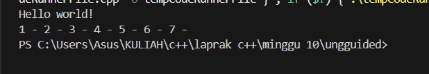
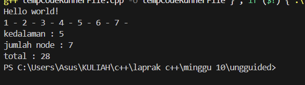
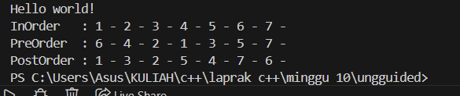

# <h1 align="center">Laporan Praktikum Modul 10 <br>  CODE BLOCKS IDE & PENGENALAN BAHASA C++</h1>
<p align="center">elfan endriyanto - 103112430040</p>

## Dasar Teori

C++ adalah bahasa pemrograman tingkat tinggi yang dikembangkan oleh Bjarne Stroustrup pada awal 1980-an di Bell Labs. Dirancang sebagai versi yang lebih lengkap dari bahasa pemrograman C, ada banyak fitur tambahan yang disertakan oleh C++.

Fitur ini termasuk object-oriented programming (OOP), pengelolaan memori secara manual, dan penggunaan template generik. Hasilnya, bahasa pemrograman ini pun menjadi lebih fleksibel dan efisien untuk berbagai kebutuhan.

C++ juga dirancang untuk menangani proyek pemrograman kompleks, termasuk aplikasi dengan performa tinggi seperti sistem operasi dan software grafis. Selain itu, C++ mendukung berbagai gaya pemrograman, mulai dari prosedural, generik, hingga berorientasi objek sehingga cocok untuk pengembangan software skala besar.

Berikut merupakan konsep dasar dalam bahasa C++

### 1. **Variabel**

Variabel adalah tempat penyimpanan data dalam program, yang memiliki nama dan nilai tertentu. Di C++, variabel memiliki tipe data yang menentukan jenis nilai yang bisa disimpan.

Berikut adalah tipe-tipe data yang ada dalam variabel C++:

- bool: singkatan dari tipe data boolean, yang hanya berisi dua nilai, yaitu True atau False.
- char: kependekan dari character, yaitu tipe data huruf dari A sampai Z.
- int: kepanjangannya adalah integer, yaitu tipe berupa angka.
- float dan double: tipe data yang berupa angka pecahan, contohnya 1,33.
- string: tipe data dalam bentuk kumpulan karakter, seperti “bahasa pemrograman C++“.

Selain itu, variabel bisa bersifat konstan dengan kata kunci const, yang artinya nilainya tidak bisa diubah setelah ditentukan. C++ juga mendukung pointer, yaitu variabel yang menyimpan alamat memori sehingga developer bisa mengontrol memori secar langsung.

Penulisan variabel dalam C++ terdiri dari dua langkah, yaitu deklarasi dan inisialisasi.

### 2. **Syntax**

Sintaks merupakan pedoman dan peraturan yang harus diikuti ketika menuliskan baris kode/instruksi dalam bahasa pemrograman. Selain itu, sintaks juga dapat dipandang sebagai kerangka yang menentukan struktur bahasa pemrograman.

Bahasa C++ juga memiliki sintaks untuk fungsi-fungsi yang sudah disediakan. Instruksi yang berbeda memiliki sintaks yang berbeda yang menentukan penggunaannya, tetapi program C++ juga memiliki aturan sintaks dasar yang diikuti di seluruh program.

- #include <iostream> : bagian ini disebut preprocessor directive untuk menyertakan file header.

- <iostream> : memberikan akses ke fungsi input-output standar dalam C++.

- using namespace std : bagian ini disebut deklarasi yang memberi tahu program untuk menggunakan namespace std yang berisi banyak fungsi dan objek standar.

- int main() : bagian ini disebut deklarasi fungsi utama (main) yang merupakan pintu masuk eksekusi untuk program C++.

- { dan } : bagian ini disebut kurung kurawal membuka dan menutup blok baris kode untuk fungsi main.

- Semicolon ( ; ) : setiap baris kode dalam contoh di atas diakhiri dengan simbol titik koma ( ; ). Simbol ini berfungsi sebagai penanda akhir dari setiap baris kode dalam program. Ketika kompiler menemui titik koma ini, proses eksekusi pada baris tersebut dihentikan dan lanjut ke baris kode berikutnya.

- return 0; : bagian ini disebut pernyataan kembalian yang mengindikasikan bahwa program telah selesai dengan sukses, sedangkan 0 adalah kode keluaran yang menunjukkan tidak ada kesalahan.

### 3. **Komentar**

Komentar dalam bahasa pemrograman C++ bertujuan untuk memberikan penjelasan mengenai setiap baris kode dengan tujuan memudahkan pembacaan. Penulisan komentar ini dilakukan untuk menyediakan informasi yang relevan terkait dengan implementasi kode yang sedang dibuat. Praktik ini umum dilakukan oleh para programmer sebagai bagian dari dokumentasi proyek mereka.

### 4. **Operasi Aritmatika**

Aritmatika adalah cabang ilmu matematika yang membahas perhitungan dasar "kabataku", yakni operasi perkalian, pembagian, penambahan dan pengurangan.

Selain keempat operasi di atas, bahasa C++ juga memiliki operasi modulo division, atau operator % yang dipakai untuk mencari sisa hasil bagi.

Berikut merupakan operasi aritmatika yang dapat dilakukan dalam bahasa C++.

- +=: assignment penambahan (Contoh: A += 7 ekuivalen dengan A = A + 7).
- -= : assignment pengurangan.
- \*= : assignment perkalian.
- /= : assignment pembagian.
- %=: assignment mod.

### 5. **Control Structures**

Control structure mengatur alur eksekusi program berdasarkan kondisi tertentu. Ada beberapa control structure utama dalam C++, termasuk if-else untuk percabangan serta for, while, dan do-while untuk loop atau perulangan.

Dengan struktur ini, program bisa memberikan respons yang berbeda tergantung pada input atau kondisi yang terjadi selama runtime. Control structure memastikan efisiensi dalam pemrosesan, terutama saat menangani data besar atau algoritma yang kompleks.

**if**<br>
Statement `if` digunakan untuk mengevaluasi ekspresi logis yang menghasilkan nilai `true` atau `false`. Apabila nilainya `true`, blok kode di dalam `if` akan dieksekusi. Kalau tidak, blok tersebut akan dilewati.

**else if dan else**<br>
Apabila kondisi di dalam `if` bernilai `false`, Anda bisa menggunakan `else if` untuk memeriksa kondisi lainnya. Kalau semua kondisi `if` dan `else if` bernilai `false`, blok `else` akan dijalankan sebagai opsi terakhir.

**for**<br>
Loop `for` digunakan untuk melakukan pengulangan dengan jumlah yang diketahui. Struktur ini mencakup **inisialisasi**, **kondisi**, dan **inkrementasi/dekrementasi** dalam satu baris.

Contohnya adalah sebagai berikut:

```c++
...
int main() {
for (int i = 0; i < 5; i++) {
    cout << "Perulangan ke-" << i << endl;
}
```

Pada contoh di atas, variabel `i` diinisialisasi dengan nilai 0. Loop akan berulang selama `i < 5`, dan setiap kali loop berakhir, nilai `i` akan bertambah 1. Pengulangan akan berhenti saat kondisi `i < 5` tidak lagi terpenuhi.

**while**<br>
Loop `while` akan terus mengeksekusi blok kode selama ekspresi kondisional bernilai `true`. Pengulangan akan berhenti begitu kondisi menjadi `false`.

**do-while**<br>
Dengan `do-while`, blok kode akan dieksekusi minimal satu kali, bahkan meskipun kondisinya bernilai `false` saat pemeriksaan pertama. Setelah satu kali eksekusi, kondisi akan diperiksa untuk menentukan apakah loop akan dijalankan lagi.

### 6. **Function**

Sebuah Function dalam C++ adalah blok kode yang dapat menerima input (dalam bentuk parameter) dari pemanggilnya, melakukan serangkaian operasi, dan secara opsional mengembalikan nilai sebagai output. Function sangat berguna untuk mengorganisir kode secara terstruktur dan dapat digunakan kembali.

**Deklarasi Function**<br>
Sebuah deklarasi Function minimal terdiri dari tipe pengembalian, nama Function, dan daftar parameter.

**Definisi Function**<br>
Definisi Function terdiri dari deklarasi dan body Function. Body Function adalah bagian dari Function yang berisi kode yang akan dieksekusi ketika Function dipanggil.

**Parameter dan Argumen**<br>
Sebuah Function memiliki daftar parameter yang memungkinkan pemanggil untuk meneruskan argumen ke dalam Function. Argumen adalah nilai konkret yang dilewatkan ke Function. Anda dapat menggunakan referensi atau nilai untuk mem-pass argumen ke dalam Function.

**Jenis Return**<br>
Jenis return function merujuk pada nilai yang dikembalikan oleh suatu fungsi setelah melakukan operasi atau pemrosesan tertentu. Dalam bahasa pemrograman C++, sebuah function dapat mengembalikan berbagai jenis nilai tergantung pada kebutuhan dan logika programnya.

### 7. **Array**

Array merupakan struktur data yang digunakan untuk `menyimpan sekumpulan data` dalam satu tempat. Setiap data dalam Array memiliki indeks, sehingga kita akan mudah memprosesnya.

Indeks array selalu dimulai dari angka nol (`0`). Pada teori struktur data ukuran array akan bergantung dari banyaknya data yang disimpan di dalamnya.

**Cara Membuat Array pada C++**<br>
Pada C++, array dapat kita buat dengan cara seperti ini.

```c++
// membuat array kosong dengan tipe data integer dan panjang 10
int nama_array[10];

// membuat array dengan langsung diisi
int nama_arr[3] = {0, 3, 2}
```

Cara membuat array hampir sama seperti cara membuat variabel biasa. Bedanya pada array kita harus menentukan panjangnya.

**Cara Mengambil Data dari Array**<br>
Seperti yang sudah kita ketahui, array akan menyimpan sekumpulan data dan memberinya nomer indeks agar mudah diakses. Indeks array selalu dimulai dari nol `0`.

Misalkan kita punya array seperti ini: <br>
`char huruf[5] = {'a', 'b', 'c', 'd', 'e'};`<br>
Bagaimana cara mengambil huruf `c`?

Jawabannya:
`huruf[2];`

**Mengisi Ulang Data Array**<br>
Data pada array dapat kita isi ulang dengan cara seperti ini:<br>
`huruf[2] = 'z';`<br>
Maka isi array `huruf` pada indeks ke-2 akan bernilai z`.

### 8. **Linked List**

Dalam C++, linked list merupakan struktur data linear yang memungkinkan user untuk menyimpan data di lokasi memory yang tidak berurutan. Sebuah linked list didefinisikan sebagai sekumpulan nodes yang dimana tiap node memiliki 2 anggota: value node itu sendiri dan petunjuk next/previous yang menyimpan alamat node berikutnya/sebelumnya.

**Representasi Linked List dalam C++**<br>
Dalam C++, linked list pada dasarnya direpresentasikan oleh pointer ke node pertama, yang umumnya disebut sebagai "**head**" dari list tersebut. Setiam node dalam list didefinisikan oleh struktur yang mencakup data field dan pointer yang mengarah ke struktur dengan tipe yang sama. Jenis struktur ini dikenal sebagai struktur self-referential.

**Singly Linked List**<br>
Singly linked List adalah bentuk paling sederhana dari linked list, di mana setiap node mengandung 2 anggota yaitu data dan next pointer yang menyimpan alamat node berikutnya. Setiap node dalam singly linked list terhubung melalui petunjuk berikutnya, dan penunjuk beriutnya dari node terakhir mengarah ke NULL, yang menandakan akhir dari linked list. Diagram berikut menggambarkan struktur singly linked list: <br>
![Diagram singly linked list]


**Doubly Linked List**<br>
Doubly Linked List adalah jenis linked list yang di mana setiap node mengandung 3 bagian: data, pointer ke node berikutnya, dan pointer ke node sebelumnya. Struktur ini memungkinkan penelusuran daftar ke arah depan dan belakang, berbeda dengan Singly Linked List yang hanya dapat ditelusuri ke arah depan.
![Diagram doubly linked list] 


### 9. **Stack**

Kontainer stack mengikuti urutan LIFO (Last In First Out) untuk proses insert dan delete. Artinya, elemen yang dimasukkan paling akhir akan dihapus terlebih dahulu, dan elemen yang dimasukkan paling awal akan dihapus terakhir. Hal ini dilakukan dengan insert dan delete elemen hanya pada satu sisi stack yang umumnya disebut sebagai top (puncak) dari stack.

**Operasi dasar Stack**

**1. Inserting Elements**<br>
Dalam stack, elemen baru hanya bisa di-insert di bagian top dari stack dengan menggunakan method push().

**2. Accessing Elements**<br>
Hanya elemen di bagian top dari stack yang bisa diakses menggunakan method top().

**3. Deleting Elements**<br>
Dalam stack, hanya elemen di bagian top yang bisa di-delete menggunakan method pop() dalam satu operasi.

**4. empty()**<br>
Method ini mengecek apakah stack kosong. Method ini mengembalikan true jika stack tidak memiliki elemen; jika tidak, method ini mengembalikan false.

**5. Size of stack**<br>
Function size() pada stack mengembalikan jumlah elemen yang sedang ada di dalam stack. Function ini membantu mengetahui berapa banyak item yang tersimpan tanpa memodifikasi stack.

### 10. **Queue**

Queue menyimpan banyak elemen dalam urutan tertentu yang disebut FIFO.

FIFO adalah singkatan dari First In, First Out. Untuk memvisualisasikan FIFO, bayangkan queue seperti orang-orang yang mengantre di sebuah supermarket. Orang yang pertama kali berdiri dalam antrean adalah orang pertama yang bisa membayar dan keluar dari supermarket. Cara pengorganisasian elemen seperti ini disebut FIFO dalam ilmu komputer dan pemrograman.

Berbeda dengan vector, elemen dalam queue tidak diakses berdasarkan nomor indeks. Karena elemen queue di-add di bagian belakang dan di-remove dari bagian depan, kita hanya bisa mengakses elemen yang ada di bagian front atau back saja.

**Operasi dasar Stack**<br>
Terdapat 2 operasi berupa Enqueue untuk insert, dan Dequeue untuk delete.

### 11. **BST (Binary Search Tree)**

Dalam C++, B-tree adalah struktur data balanced tree yang menjaga data tetap terurut dan memungkinkan proses search, sequential access, insert, dan delete dalam waktu logaritmik. B-tree merupakan generalisasi dari Binary Search Tree (BST) karena sebuah node dapat memiliki lebih dari dua child. B-tree dioptimalkan untuk sistem yang melakukan read dan write data dalam blok berukuran besar. Pada artikel ini, kita akan mempelajari cara mengimplementasikan B-tree dalam bahasa pemrograman C++.

**Properti B-tree**<br>
B-tree adalah self-balancing search tree di mana setiap node dapat memiliki banyak child. Struktur ini menjaga keseimbangan dengan memastikan semua leaf node berada pada level yang sama. Jumlah child dari sebuah node dibatasi dalam rentang tertentu yang telah ditentukan sebelumnya.

- B-tree memiliki properti sebagai berikut:
- Setiap node memiliki maksimal m child.
- Setiap non-leaf node (kecuali root) memiliki minimal ⌈m/2⌉ child.
- Root node memiliki minimal dua child.
- Non-leaf node dengan k child memiliki k−1 key.
- Semua leaf node berada pada level yang sama dan tidak menyimpan key.

**Implementasi B-tree dalam C++**<br>
B-tree dapat diimplementasikan menggunakan sebuah struktur node yang berisi array key dan array pointer ke child. Jumlah key dalam sebuah node selalu satu lebih sedikit dibandingkan jumlah pointer ke child. Diagram berikut merepresentasikan struktur dari sebuah B-tree:
![Diagram B-tree] 


## Guided

### soal tree.cpp

```go
#include<iostream>
using namespace std;

struct  Node
{
    int data;
    Node *kiri, *kanan;
};

//fungsi buat node baru
Node *buatNode(int nilai)
{
    Node *baru = new Node();
    baru->data = nilai;
    baru->kiri = baru->kanan = NULL;
    return baru;
}

//1. INSERT (menyisipkan data)
Node *insert(Node *root, int nilai)
{
    if (root == NULL)
        return buatNode(nilai);

    if (nilai < root->data)
        root->kiri = insert(root->kiri, nilai); // masukan kiri jika lebih kecil
    else if (nilai > root->data)
        root->kanan = insert(root->kanan, nilai); //masukan kanan jika lebih besar
    
    return root;
}

//2. SEARCH (mencari)
Node *search(Node *root, int nilai)
{
    if (root == NULL || root->data == nilai)
        return root; //ketemu atau tidak ada

    if (nilai < root ->data)
        return search(root->kiri, nilai); // cari ke kiri
    
    return search(root->kanan, nilai); //cari kanan
}

//helper: cari nilai terkecil(unutuk proses hapus )
Node *nilaiTerkecil(Node *node)
{
    Node *current = node;
    while (current && current->kiri != NULL)
        current = current->kiri;
    return current;
}

//3. DELETE(menghapus Data - diperlukan untuk Update)
Node *hapus(Node *root, int nilai)
{
    if (root == NULL)
        return root;

    if (nilai < root->data)
        root->kiri = hapus(root->kiri, nilai);
    else if ( nilai > root->data)
        root->kanan = hapus(root->kanan, nilai);
    else
    {
        // jika data ketemu
        if(root->kiri == NULL)
        {
            Node *temp = root->kanan;
            delete root;
            return temp;
        }
        else if(root->kanan == NULL)
        {
            Node *temp = root->kiri;
            delete root;
            return temp;
        }
        // jika punya 2 anak ;ammbil terkecil dari kanan
        Node *temp = nilaiTerkecil(root->kanan);
        root->data = temp->data;
        root->kanan = hapus(root->kanan, temp->data);
    }
    return root;
}

//4. UPDATE (ubah data)
Node *update(Node *root, int lama, int baru)
{
    if ( search(root, lama) != NULL)
    {
        root = hapus(root, lama); // hapus yang lama
        root = insert(root, baru); // masukkan yang baru
        cout << "data " << lama << " diupdate menjadi " << baru << endl;
    }
    else
    {
        cout << "data " << lama << " tidak ditemukan! " << endl;
    }
    return root;

}
// 5. TRAVERSAL (Menampilkan Data)
void preOrder(Node *root)
{// akar -> kiri -> kanan
    if (root != NULL)
    {
        cout << root->data << " ";
        preOrder(root->kiri);
        preOrder(root->kanan);
    }

}

void inOrder(Node *root)
{// kiri-> akar -> kanan
    if (root != NULL)
    {
        inOrder(root->kiri);
        cout << root->data << " ";
        inOrder(root->kanan);
    }

}

void postOrder(Node *root)
{// kiri -> kanan -> akar
    if (root != NULL)
    {
        postOrder(root->kiri);
        postOrder(root->kanan);
        cout << root->data << " ";
    }

}

int main ()
{
    Node *root = NULL;

    cout << "=== 1. INSERT DATA ===" << endl;
    root = insert(root, 10);
    insert(root, 5);
    insert(root, 20);
    insert(root, 3);
    insert(root, 7);
    insert(root, 15);
    insert(root, 25);
    cout << "Data berhasil dimasukan,\n" << endl;

    cout << "=== 2. TAMPILKAN TREE (TRAVERSAL) ===" << endl;
    cout << "preOreder   : ";
    preOrder(root);
    cout << endl;
    cout << "inOreder    : ";
    inOrder(root);
    cout << endl;
    cout << "postOreder  : ";
    postOrder(root);
    cout << "\n" << endl;

    cout << "=== 3. TEST SEARCH ===" << endl;
    int cari1 = 7, cari2 = 99;
    cout << "cari " << cari1 << ": " << (search(root, cari1) ? "ketemu" : "Tidak ada") << endl;
    cout << "cari " << cari2 << ": " << (search(root, cari2) ? "ketemu" : "Tidak ada") << endl;
    cout << endl;

    cout << "=== 4. TEST UPDATE ===" << endl;
    // mengubah angka 5 menjadi 8
    root = update(root, 5, 8);
    cout << "Hasil InOrder setelah Update: ";
    cout << endl;
    cout << endl;

    cout << "PreOrder  : ";
    preOrder(root);
    cout << endl;
    cout << "InOrder   : ";
    inOrder(root);
    cout << endl;
    cout << "PostOrder : ";
    postOrder(root);
    cout << "\n" << endl;

    cout << "=== 5. TEST DELETE ===" << endl;
    // Menghapus angka 20 (Node yang punya anak)
    cout << "Menghapus angka 20..." << endl;
    root = hapus(root, 20);

    cout << "PreOrder  : ";
    preOrder(root);
    cout << endl;
    cout << "InOrder   : ";
    inOrder(root);
    cout << endl;
    cout << "PostOrder : ";
    postOrder(root);
    cout << "\n" << endl;

    return 0;
}
         

```
> Output

> 

penjelasan kode

Program ini mengimplementasikan **Binary Search Tree (BST)**, yaitu struktur data berbentuk pohon di mana setiap node memiliki paling banyak dua anak, dengan aturan node kiri lebih kecil dan node kanan lebih besar dari parent. Program mendukung operasi utama seperti **insert** untuk menambahkan node baru, **search** untuk mencari node tertentu, **update** untuk mengubah nilai node, **delete** untuk menghapus node dengan penanganan semua kasus (0, 1, atau 2 anak), serta **traversal** (preorder, inorder, postorder) untuk menampilkan isi tree. Dengan BST, data tersusun secara hierarkis sehingga pencarian dan pengurutan menjadi efisien, dan traversal inorder selalu menampilkan data dalam urutan menaik.

## Unguided

### Soal 1,1 bstree.h

```go
#ifndef BSTREE_H
#define BSTREE_H

#include <iostream>
using namespace std;

typedef int infotype;
typedef struct Node* address;

struct Node {
    infotype info;
    address left;
    address right;
};

#define Nil NULL

address alokasi(infotype x);
void insertNode(address &root, infotype x);
address findNode(infotype x, address root);

void InOrder(address root);
void PreOrder(address root);
void PostOrder(address root);

int hitungNode(address root);
int hitungTotal(address root);
int hitungKedalaman(address root, int start);

#endif


```
penjelasan kode

Kode BSTREE_H ini berisi definisi ADT Binary Search Tree (BST) untuk menyimpan data bertipe integer. Setiap node memiliki satu data (info) serta dua pointer, yaitu left untuk anak kiri dan right untuk anak kanan, yang disusun berdasarkan aturan BST. Header ini menyediakan fungsi untuk mengalokasikan node baru, memasukkan data ke dalam tree, dan mencari node tertentu. Selain itu, terdapat fungsi traversal InOrder, PreOrder, dan PostOrder untuk menelusuri isi tree, serta fungsi tambahan untuk menghitung jumlah node, total nilai seluruh node, dan kedalaman tree. Secara keseluruhan, kode ini digunakan sebagai kerangka dasar pengolahan data menggunakan struktur Binary Search Tree.

### Soal 1,2 bstree.cpp

```go

#include "bstree.h"

address alokasi(infotype x) {
    address p = new Node;
    p->info = x;
    p->left = Nil;
    p->right = Nil;
    return p;
}

void insertNode(address &root, infotype x) {
    if (root == Nil) {
        root = alokasi(x);
    }
    else if (x < root->info) {
        insertNode(root->left, x);
    }
    else if (x > root->info) {
        insertNode(root->right, x);
    }
    // jika x == root->info → diabaikan
}

address findNode(infotype x, address root) {
    if (root == Nil || root->info == x)
        return root;
    if (x < root->info)
        return findNode(x, root->left);
    return findNode(x, root->right);
}

void InOrder(address root) {
    if (root != Nil) {
        InOrder(root->left);
        cout << root->info << " - ";
        InOrder(root->right);
    }
}

void PreOrder(address root) {
    if (root != Nil) {
        cout << root->info << " - ";
        PreOrder(root->left);
        PreOrder(root->right);
    }
}

void PostOrder(address root) {
    if (root != Nil) {
        PostOrder(root->left);
        PostOrder(root->right);
        cout << root->info << " - ";
    }
}

int hitungNode(address root) {
    if (root == Nil)
        return 0;
    return 1 + hitungNode(root->left) + hitungNode(root->right);
}

int hitungTotal(address root) {
    if (root == Nil)
        return 0;
    return root->info + hitungTotal(root->left) + hitungTotal(root->right);
}

int hitungKedalaman(address root, int start) {
    if (root == Nil)
        return start;
    int kiri = hitungKedalaman(root->left, start + 1);
    int kanan = hitungKedalaman(root->right, start + 1);
    return (kiri > kanan) ? kiri : kanan;
}


```
penjelasan kode

Kode bstree.cpp ini merupakan implementasi ADT Binary Search Tree (BST). Program ini mengatur proses pembuatan node baru, penyisipan data ke dalam tree sesuai aturan BST (nilai lebih kecil ke kiri dan lebih besar ke kanan), serta pencarian data secara rekursif. Selain itu, disediakan tiga metode traversal yaitu InOrder, PreOrder, dan PostOrder untuk menampilkan isi tree dengan urutan yang berbeda. Kode ini juga menyediakan fungsi untuk menghitung jumlah node, total nilai seluruh node, dan kedalaman maksimum tree, sehingga struktur dan isi BST dapat dianalisis dengan mudah.

### Soal 1 main1.cpp

```go
#include <iostream>
#include "bstree.h"
#include "bstree.cpp"
using namespace std;

int main() {
    cout << "Hello world!" << endl;

    address root = Nil;

    insertNode(root,1);
    insertNode(root,2);
    insertNode(root,6);
    insertNode(root,4);
    insertNode(root,5);
    insertNode(root,3);
    insertNode(root,6);
    insertNode(root,7);

    InOrder(root);

    return 0;
}

```
> Output

> 

penjelasan kode

Program main.cpp ini digunakan untuk menguji implementasi Binary Search Tree (BST). Program dimulai dengan membuat tree kosong, lalu beberapa nilai dimasukkan ke dalam tree menggunakan fungsi insertNode, di mana nilai yang lebih kecil akan ditempatkan di sebelah kiri dan nilai yang lebih besar di sebelah kanan sesuai aturan BST, sedangkan data yang sama akan diabaikan. Setelah semua data dimasukkan, fungsi InOrder traversal dipanggil untuk menampilkan isi tree, sehingga output yang dihasilkan berupa data yang sudah tersusun secara menaik, yaitu 1 - 2 - 3 - 4 - 5 - 6 - 7 -. Output ini menunjukkan bahwa struktur BST dan proses traversal telah berjalan dengan benar.

### Soal 2 main2.cpp

```go
#include <iostream>
#include "bstree.h"
#include "bstree.cpp"
using namespace std;

int main() {
    cout << "Hello world!" << endl;

    address root = Nil;

    insertNode(root,1);
    insertNode(root,2);
    insertNode(root,6);
    insertNode(root,4);
    insertNode(root,5);
    insertNode(root,3);
    insertNode(root,6);
    insertNode(root,7);

    InOrder(root);
    cout << endl;

    cout << "kedalaman : " << hitungKedalaman(root,0) << endl;
    cout << "jumlah node : " << hitungNode(root) << endl;
    cout << "total : " << hitungTotal(root) << endl;

    return 0;
}


```
> Output

> 

penjelasan kode

Program main.cpp ini merupakan pengujian lanjutan dari ADT Binary Search Tree (BST). Setelah tree diisi dengan beberapa nilai, program menampilkan isi tree menggunakan traversal InOrder sehingga data terlihat sudah terurut menaik. Selanjutnya, program menghitung dan menampilkan kedalaman tree, jumlah node, serta total nilai seluruh node. Dari output terlihat bahwa tree memiliki kedalaman 5, jumlah node sebanyak 7 (karena nilai duplikat tidak dimasukkan), dan total nilai seluruh node adalah 28. Hasil ini menunjukkan bahwa seluruh fungsi BST—mulai dari penyisipan, traversal, hingga perhitungan—telah berjalan dengan benar.

### Soal 3 main3.cpp

```go
#include <iostream>
#include "bstree.h"
#include "bstree.cpp"
using namespace std;

int main() {
    cout << "Hello world!" << endl;

    address root = Nil;

    insertNode(root,6);
    insertNode(root,4);
    insertNode(root,7);
    insertNode(root,2);
    insertNode(root,5);
    insertNode(root,1);
    insertNode(root,3);

    cout << "InOrder   : ";
    InOrder(root);
    cout << endl;

    cout << "PreOrder  : ";
    PreOrder(root);
    cout << endl;

    cout << "PostOrder : ";
    PostOrder(root);
    cout << endl;

    return 0;
}

```
> Output

> 

penjelasan kode

Program main.cpp ini digunakan untuk menguji tiga jenis traversal pada Binary Search Tree (BST). Setelah beberapa nilai dimasukkan ke dalam tree sesuai aturan BST, program menampilkan hasil InOrder, PreOrder, dan PostOrder. Output InOrder menunjukkan data dalam urutan menaik, PreOrder menampilkan urutan akar lalu subtree kiri dan kanan, sedangkan PostOrder menampilkan subtree kiri, subtree kanan, lalu akar. Hasil output yang ditampilkan sudah sesuai dengan teori traversal BST, sehingga dapat disimpulkan bahwa struktur tree dan fungsi traversal bekerja dengan benar.

## Referensi

1. _Hostinger_. https://www.hostinger.com/id/tutorial/bahasa-pemrograman-cpp. Diakses pada 03 Oktober 2025.
2. _Dicoding_. https://www.dicoding.com/blog/memahami-esensi-bahasa-pemrograman-c/. Diakses pada 03 Oktober 2025.
3. _Duniailkom_. https://www.duniailkom.com/tutorial-belajar-c-plus-plus-jenis-jenis-operator-aritmatika-bahasa-c-plus-plus/. Diakses pada 03 Oktober 2025.
4. _kodingakademi_. https://www.kodingakademi.id/function-c-panduan-lengkap/. Diakses pada 03 Oktober 2025.
5. _petanikode_ . https://www.petanikode.com/cpp-array/. Diakses pada 06 Oktober 2025.
6. _GeekForGeeks_. https://www.geeksforgeeks.org/cpp/cpp-linked-list/. Diakses pada 13 Oktober 2025.
7. _GeekForGeeks_. https://www.geeksforgeeks.org/cpp/doubly-linked-list-in-cpp/. Diakses pada 27 Oktober 2025.
8. _GeekForGeeks_. https://www.geeksforgeeks.org/cpp/stack-in-cpp-stl/. Diakses pada 4 November 2025.
9. _W3schools_. https://www.w3schools.com/cpp/cpp_queues.asp. Diakses pada 14 November 2025.
10. _GeeksForGeeks_. https://www.geeksforgeeks.org/cpp/b-tree-implementation-in-cpp/. Diakses pada 6 Desember 2025.
