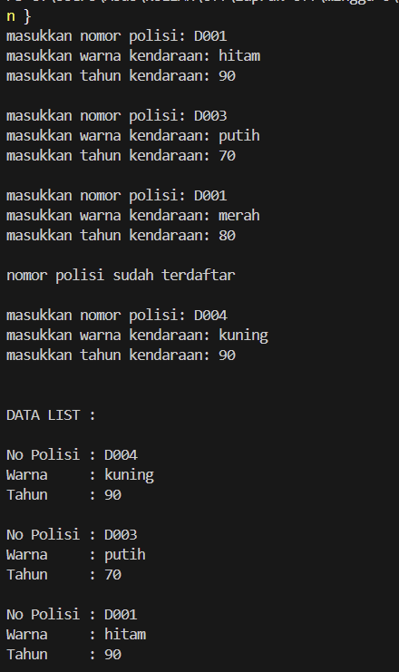
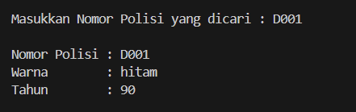
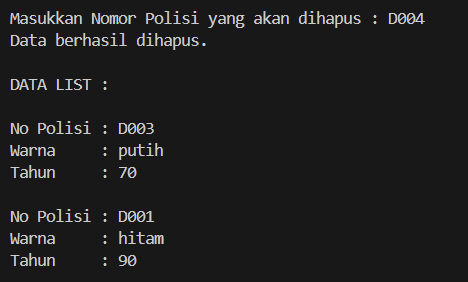

# <h1 align="center">Laporan Praktikum Modul 6 <br>  CODE BLOCKS IDE & PENGENALAN BAHASA C++</h1>
<p align="center">elfan endriyanto - 103112430040</p>

## Dasar Teori

Bahasa pemrograman C++ adalah salah satu bahasa tingkat tinggi yang banyak dimanfaatkan baik di lingkungan pendidikan maupun industri. Pada umumnya, susunan program C++ diawali dengan header file seperti #include, yang berfungsi untuk mendukung proses input dan output standar. Menurut pendapat Indahyati dan Rahmawati (2020), C++ menjadi dasar penting dalam memahami konsep algoritma serta pemrograman, terutama karena struktur sintaksnya relatif sederhana dan mudah dipahami oleh pemula.


## Guided

### soal 1

aku mengerjakan perulangan

## Unguided

### Soal 1,1 Doublylist.h

```go
#ifndef DOUBLYLIST_H
#define DOUBLYLIST_H

#include <string>
using namespace std;

struct kendaraan {
    string nopol;
    string warna;
    int thnBuat;
};

typedef kendaraan infotype;

struct ElmList {
    infotype info;
    ElmList* next;
    ElmList* prev;
};

typedef ElmList* address;

struct List {
    address First;
    address Last;
};

void CreateList(List &L);
address alokasi(infotype x);
void dealokasi(address &P);
void printInfo(List L);
void printInfoReverse(List L);
void insertLast(List &L, address P);
address findElm(List L, string nopolDicari);
void deleteFirst(List &L, address &P);
void deleteLast(List &L, address &P);
void deleteAfter(address Prec, address &P);

#endif

```

Program ini menjelaskan tentang mengelola **antrian pembeli** menggunakan **linked list**, di mana setiap pembeli memiliki data **nama** dan **pesanan**. Fitur yang ada di program ini yaitu **menambah antrian**, **melayani antrian (menghapus dari depan)**, **menampilkan seluruh antrian**, serta **mencari pembeli berdasarkan nama**. Data pembeli disimpan berurutan sesuai urutan masuk, dan program berjalan melalui menu sampai pengguna memilih keluar.

### Soal 1,2 Doublylist.cpp

```go
#include "Doublylist.h"
#include <iostream>
using namespace std;

void CreateList(List &L) {
    L.First = NULL;
    L.Last = NULL;
}

address alokasi(infotype x) {
    address P = new ElmList;
    P->info = x;
    P->next = NULL;
    P->prev = NULL;
    return P;
}

void dealokasi(address &P) {
    delete P;
    P = NULL;
}

void insertLast(List &L, address P) {
    if (L.First == NULL) {
        L.First = P;
        L.Last = P;
    } else {
        L.Last->next = P;
        P->prev = L.Last;
        L.Last = P;
    }
}

address findElm(List L, string nopolDicari) {
    address P = L.First;
    while (P != NULL) {
        if (P->info.nopol == nopolDicari)
            return P;
        P = P->next;
    }
    return NULL;
}

void printInfo(List L) {
    address P = L.First;
    while (P != NULL) {
        cout << "No Polisi : " << P->info.nopol << endl;
        cout << "Warna     : " << P->info.warna << endl;
        cout << "Tahun     : " << P->info.thnBuat << endl << endl;
        P = P->next;
    }
}

void printInfoReverse(List L) {
    address P = L.Last;
    while (P != NULL) {
        cout << "No Polisi : " << P->info.nopol << endl;
        cout << "Warna     : " << P->info.warna << endl;
        cout << "Tahun     : " << P->info.thnBuat << endl << endl;
        P = P->prev;
    }
}

void deleteFirst(List &L, address &P) {
    P = L.First;
    if (P == NULL) return;

    if (L.First == L.Last) {
        L.First = NULL;
        L.Last = NULL;
    } else {
        L.First = P->next;
        L.First->prev = NULL;
    }
}

void deleteLast(List &L, address &P) {
    P = L.Last;
    if (P == NULL) return;

    if (L.First == L.Last) {
        L.First = NULL;
        L.Last = NULL;
    } else {
        L.Last = P->prev;
        L.Last->next = NULL;
    }
}

void deleteAfter(address Prec, address &P) {
    if (Prec == NULL || Prec->next == NULL) return;

    P = Prec->next;
    Prec->next = P->next;

    if (P->next != NULL) {
        P->next->prev = Prec;
    }
}


```
penjelasan kode

Program ini menejelaskan tentang mengelola data buku dengan **linked list**, di mana setiap buku punya data **judul**, **penulis**, dan **ISBN**. Fitur utamanya yaitu **menambah**, **menampilkan**, **mencari**, dan **menghapus** buku berdasarkan ISBN. Semua proses dilakukan lewat menu , dan program berjalan terus sampai pengguna memilih keluar.

### Soal 1,3 main.cpp

```go
#include <iostream>
#include <string>
#include "Doublylist.h"
#include "Doublylist.cpp"
using namespace std;

int main() {
    List L;
    CreateList(L);

    infotype x;
    int validData = 0;

    while (validData < 3) {
        cout << "masukkan nomor polisi: ";
        cin >> x.nopol;
        cout << "masukkan warna kendaraan: ";
        cin >> x.warna;
        cout << "masukkan tahun kendaraan: ";
        cin >> x.thnBuat;
        cout << endl;

        if (findElm(L, x.nopol) != NULL) {
            cout << "nomor polisi sudah terdaftar\n\n";
        } else {
            insertLast(L, alokasi(x));
            validData++;
        }
    }

    cout << "\nDATA LIST : \n\n";
    printInfoReverse(L);

    string cariNopol;
    cout << "Masukkan Nomor Polisi yang dicari : ";
    cin >> cariNopol;

    address F = findElm(L, cariNopol);
    if (F != NULL) {
        cout << "\nNomor Polisi : " << F->info.nopol << endl;
        cout << "Warna        : " << F->info.warna << endl;
        cout << "Tahun        : " << F->info.thnBuat << endl;
    } else {
        cout << "Data tidak ditemukan.\n";
    }

    string delNopol;
    cout << "\nMasukkan Nomor Polisi yang akan dihapus : ";
    cin >> delNopol;

    address P = findElm(L, delNopol);
    if (P != NULL) {
        if (P == L.First)
            deleteFirst(L, P);
        else if (P == L.Last)
            deleteLast(L, P);
        else
            deleteAfter(P->prev, P);

        dealokasi(P);
        cout << "Data berhasil dihapus.\n";
    } else {
        cout << "Data tidak ditemukan.\n";
    }

    cout << "\nDATA LIST : \n\n";
    printInfoReverse(L);

    return 0;
}


```

> Output
> 
> 
> 

penjelasan kode

Program ini menejelaskan tentang mengelola data buku dengan **linked list**, di mana setiap buku punya data **judul**, **penulis**, dan **ISBN**. Fitur utamanya yaitu **menambah**, **menampilkan**, **mencari**, dan **menghapus** buku berdasarkan ISBN. Semua proses dilakukan lewat menu , dan program berjalan terus sampai pengguna memilih keluar.


## Referensi

1. https://en.wikipedia.org/wiki/Data_structure (diakses blablabla)
