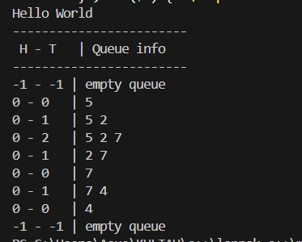
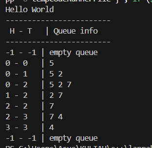
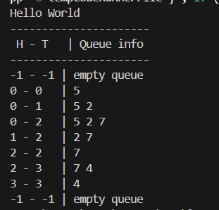

# <h1 align="center">Laporan Praktikum Modul 8 <br>  CODE BLOCKS IDE & PENGENALAN BAHASA C++</h1>
<p align="center">elfan endriyanto - 103112430040</p>

## Dasar Teori

Bahasa pemrograman C++ adalah salah satu bahasa tingkat tinggi yang banyak dimanfaatkan baik di lingkungan pendidikan maupun industri. Pada umumnya, susunan program C++ diawali dengan header file seperti #include, yang berfungsi untuk mendukung proses input dan output standar. Menurut pendapat Indahyati dan Rahmawati (2020), C++ menjadi dasar penting dalam memahami konsep algoritma serta pemrograman, terutama karena struktur sintaksnya relatif sederhana dan mudah dipahami oleh pemula.


## Guided

### soal 1

aku mengerjakan perulangan

## Unguided

### Soal 1,1 queue1.h

```go
#ifndef QUEUE_H
#define QUEUE_H

const int MaxEl = 5;
typedef int infotype;

struct Queue {
    infotype info[MaxEl];
    int head, tail;
};

void CreateQueue(Queue &Q);
bool isEmptyQueue(Queue Q);
bool isFullQueue(Queue Q);
void enqueue(Queue &Q, infotype x);
infotype dequeue(Queue &Q);
void printInfo(Queue Q);

#endif

```
penjelasan kode

Kode QUEUE_H ini merupakan ADT queue sederhana yang menggunakan array dengan kapasitas maksimum 5 elemen. Struktur Queue memiliki array info untuk menyimpan data serta dua penunjuk, yaitu head sebagai posisi elemen terdepan dan tail sebagai posisi elemen terakhir. Di dalam header ini disediakan fungsi untuk membuat queue kosong, mengecek apakah queue kosong atau penuh, menambahkan data ke queue (enqueue), mengambil data terdepan dari queue (dequeue), serta menampilkan seluruh isi queue. Secara keseluruhan, kode ini menerapkan konsep antrian FIFO (First In First Out) dengan cara yang sederhana dan terstruktur.

### Soal 1,2 queue1.cpp

```go


#include <iostream>
#include "queue1.h"
using namespace std;

void CreateQueue(Queue &Q) {
    Q.head = -1;
    Q.tail = -1;
}

bool isEmptyQueue(Queue Q) {
    return (Q.head == -1 && Q.tail == -1);
}

bool isFullQueue(Queue Q) {
    return (Q.tail == MaxEl - 1);
}

void enqueue(Queue &Q, infotype x) {
    if (isFullQueue(Q)) {
        cout << "Queue penuh" << endl;
    } else {
        if (isEmptyQueue(Q)) {
            Q.head = 0;
            Q.tail = 0;
        } else {
            Q.tail++;
        }
        Q.info[Q.tail] = x;
    }
}

infotype dequeue(Queue &Q) {
    infotype x = -1;
    if (isEmptyQueue(Q)) {
        cout << "Queue kosong" << endl;
    } else {
        x = Q.info[Q.head];

        if (Q.head == Q.tail) {
            Q.head = Q.tail = -1;
        } else {
            for (int i = Q.head; i < Q.tail; i++) {
                Q.info[i] = Q.info[i + 1];
            }
            Q.tail--;
        }
    }
    return x;
}

void printInfo(Queue Q) {
    cout << Q.head << " - " << Q.tail << "\t| ";

    if (isEmptyQueue(Q)) {
        cout << "empty queue";
    } else {
        for (int i = Q.head; i <= Q.tail; i++) {
            cout << Q.info[i] << " ";
        }
    }
    cout << endl;
}

```
penjelasan kode

Kode queue.cpp ini merupakan implementasi dari ADT queue berbasis array dengan kapasitas terbatas. Program ini mengatur proses pembuatan queue kosong, pengecekan kondisi kosong dan penuh, penambahan data ke antrian (enqueue), serta pengambilan data dari antrian (dequeue) sesuai konsep FIFO. Saat dequeue dilakukan, elemen-elemen di dalam array digeser ke depan agar posisi head tetap di indeks awal. Selain itu, fungsi printInfo digunakan untuk menampilkan isi queue beserta posisi head dan tail, sehingga kondisi queue dapat terlihat dengan jelas saat program dijalankan.

### Soal 1,3 main1.cpp

```go
#include <iostream>
#include "queue1.h"
#include "queue1.cpp"
using namespace std;

int main() {
    cout << "Hello World" << endl;

    Queue Q;
    CreateQueue(Q);

    cout << "------------------------" << endl;
    cout << " H - T \t | Queue info" << endl;
    cout << "------------------------" << endl;

    printInfo(Q);            

    enqueue(Q, 5); printInfo(Q);
    enqueue(Q, 2); printInfo(Q);
    enqueue(Q, 7); printInfo(Q);

    dequeue(Q); printInfo(Q);
    dequeue(Q); printInfo(Q);

    enqueue(Q, 4); printInfo(Q);

    dequeue(Q); printInfo(Q);
    dequeue(Q); printInfo(Q);

    return 0;
}


```
> Output

> 

penjelasan kode
Program main.cpp ini menunjukkan hasil pengujian ADT queue berbasis array. Dari output terlihat bahwa pada awal program queue masih kosong dengan nilai head dan tail sama-sama -1. Saat operasi enqueue dilakukan, data masuk ke queue secara berurutan dan posisi tail bertambah, sedangkan head tetap di awal. Ketika dequeue dijalankan, elemen paling depan dihapus sesuai konsep FIFO, lalu isi queue bergeser ke depan sehingga urutan data tetap rapi. Proses ini terus berlangsung sampai semua data habis, dan pada kondisi akhir queue kembali kosong dengan head dan tail bernilai -1.

### Soal 2,1 queue2.h

```go
#ifndef QUEUE_H
#define QUEUE_H

const int MaxEl = 5;
typedef int infotype;

struct Queue {
    infotype info[MaxEl];
    int head;
    int tail;
};

void CreateQueue(Queue &Q);
bool isEmptyQueue(Queue Q);
bool isFullQueue(Queue Q);
void enqueue(Queue &Q, infotype x);
infotype dequeue(Queue &Q);
void printInfo(Queue Q);

#endif


```
penjelasan kode

Kode QUEUE_H ini berisi definisi ADT queue sederhana dengan kapasitas maksimal 5 elemen yang disimpan menggunakan array. Struktur Queue memiliki variabel head untuk menunjuk elemen terdepan dan tail untuk menunjuk elemen terakhir dalam antrian. Di dalam header ini disediakan fungsi-fungsi dasar untuk membuat queue kosong, mengecek apakah queue kosong atau penuh, menambahkan data ke antrian (enqueue), menghapus data terdepan (dequeue), serta menampilkan isi queue. Seluruh operasi queue ini menerapkan konsep FIFO (First In First Out) secara terstruktur dan mudah dipahami.

### Soal 2,2 queue2.cpp

```go
#include <iostream>
#include "queue2.h"
using namespace std;

void CreateQueue(Queue &Q) {
    Q.head = -1;
    Q.tail = -1;
}

bool isEmptyQueue(Queue Q) {
    return (Q.head == -1);
}

bool isFullQueue(Queue Q) {
    return ((Q.tail + 1) % MaxEl == Q.head);
}

void enqueue(Queue &Q, infotype x) {
    if (isFullQueue(Q)) {
        cout << "Queue penuh" << endl;
        return;
    }

    if (isEmptyQueue(Q)) {
        Q.head = 0;
        Q.tail = 0;
    } else {
        Q.tail = (Q.tail + 1) % MaxEl;
    }

    Q.info[Q.tail] = x;
}

infotype dequeue(Queue &Q) {
    if (isEmptyQueue(Q)) {
        cout << "Queue kosong" << endl;
        return -1;
    }

    infotype val = Q.info[Q.head];

    if (Q.head == Q.tail) {
        Q.head = Q.tail = -1;
    } else {
        Q.head = (Q.head + 1) % MaxEl;
    }

    return val;
}

void printInfo(Queue Q) {
    cout << Q.head << " - " << Q.tail << "\t| ";

    if (isEmptyQueue(Q)) {
        cout << "empty queue" << endl;
        return;
    }

    int i = Q.head;
    while (true) {
        cout << Q.info[i] << " ";
        if (i == Q.tail) break;
        i = (i + 1) % MaxEl;
    }
    cout << endl;
}

```
penjelasan kode

Kode queue2.cpp ini merupakan implementasi ADT circular queue (queue melingkar) berbasis array. Queue dibuat dengan penanda head dan tail yang akan berputar menggunakan operasi modulo (% MaxEl) sehingga ruang array bisa dimanfaatkan kembali tanpa perlu menggeser data. Program ini menyediakan fungsi untuk membuat queue kosong, mengecek kondisi kosong dan penuh, menambahkan data ke queue (enqueue), menghapus data terdepan (dequeue), serta menampilkan isi queue sesuai urutan antrian. Dengan konsep circular queue ini, proses enqueue dan dequeue menjadi lebih efisien dan tetap mengikuti prinsip FIFO (First In First Out).

### Soal 2,3 main2.cpp

```go
#include <iostream>
#include "queue2.h"
#include "queue2.cpp"
using namespace std;

int main() {
    cout << "Hello World" << endl;

    Queue Q;
    CreateQueue(Q);

    cout << "------------------------" << endl;
    cout << " H - T \t | Queue info" << endl;
    cout << "------------------------" << endl;

    printInfo(Q);                   

    enqueue(Q, 5); printInfo(Q);     
    enqueue(Q, 2); printInfo(Q);     
    enqueue(Q, 7); printInfo(Q);     

    dequeue(Q); printInfo(Q);        
    dequeue(Q); printInfo(Q);        

    enqueue(Q, 4); printInfo(Q);     

    dequeue(Q); printInfo(Q);        
    dequeue(Q); printInfo(Q);        

    return 0;
}

```
> Output

> 

penjelasan kode

Program main.cpp ini digunakan untuk menguji implementasi circular queue. Dari output terlihat bahwa pada awal program queue masih kosong dengan nilai head dan tail sama-sama -1. Saat operasi enqueue dilakukan, data masuk ke queue secara berurutan dan posisi tail bertambah, sementara head menunjuk elemen terdepan. Ketika dequeue dijalankan, elemen paling depan dihapus dan head berpindah ke indeks berikutnya tanpa perlu menggeser isi array, karena queue bersifat melingkar. Proses ini terus berlanjut hingga seluruh data dikeluarkan, dan pada kondisi akhir queue kembali kosong dengan head dan tail bernilai -1. Output tersebut menunjukkan bahwa mekanisme circular queue sudah berjalan dengan benar dan tetap mengikuti konsep FIFO.


### Soal 3,1 queue3.h

```go
#ifndef QUEUE_H
#define QUEUE_H

const int MaxEl = 5;
typedef int infotype;

struct Queue {
    infotype info[MaxEl];
    int head;
    int tail;
    int count;     
};

void CreateQueue(Queue &Q);
bool isEmptyQueue(Queue Q);
bool isFullQueue(Queue Q);
void enqueue(Queue &Q, infotype x);
infotype dequeue(Queue &Q);
void printInfo(Queue Q);

#endif


```
penjelasan kode

Kode QUEUE_H ini merupakan pengembangan ADT queue berbasis array dengan kapasitas maksimum 5 elemen, di mana selain head dan tail, ditambahkan variabel count untuk menyimpan jumlah elemen yang ada di dalam queue. Dengan adanya count, proses pengecekan kondisi kosong dan penuh menjadi lebih mudah dan jelas, tanpa hanya bergantung pada posisi indeks. Header ini juga menyediakan fungsi untuk membuat queue kosong, mengecek apakah queue kosong atau penuh, menambahkan data (enqueue), menghapus data terdepan (dequeue), serta menampilkan isi queue. Seluruh mekanisme tetap mengikuti konsep FIFO (First In First Out).

### Soal 3,2 queue3.cpp

```go
#include <iostream>
#include "queue3.h"
using namespace std;

void CreateQueue(Queue &Q) {
    Q.head = -1;
    Q.tail = -1;
    Q.count = 0;
}

bool isEmptyQueue(Queue Q) {
    return (Q.count == 0);
}

bool isFullQueue(Queue Q) {
    return (Q.count == MaxEl);
}

void enqueue(Queue &Q, infotype x) {
    if (isFullQueue(Q)) {
        cout << "Queue penuh" << endl;
        return;
    }

    if (isEmptyQueue(Q)) {
        Q.head = 0;
        Q.tail = 0;
        Q.info[Q.tail] = x;
        Q.count = 1;
    } else {
        Q.tail = (Q.tail + 1) % MaxEl;
        Q.info[Q.tail] = x;
        Q.count++;
    }
}

infotype dequeue(Queue &Q) {
    if (isEmptyQueue(Q)) {
        cout << "Queue kosong" << endl;
        return -1;
    }

    infotype val = Q.info[Q.head];

    Q.head = (Q.head + 1) % MaxEl;
    Q.count--;

    if (Q.count == 0) {
        Q.head = -1;
        Q.tail = -1;
    }

    return val;
}

void printInfo(Queue Q) {
    if (isEmptyQueue(Q)) {
        cout << "-1 - -1\t| empty queue" << endl;
        return;
    }

    cout << Q.head << " - " << Q.tail << "\t| ";

    int idx = Q.head;
    for (int i = 0; i < Q.count; i++) {
        cout << Q.info[idx] << " ";
        idx = (idx + 1) % MaxEl;
    }
    cout << endl;
}


```
penjelasan kode

Kode queue3.cpp ini merupakan implementasi ADT circular queue yang ditingkatkan dengan penggunaan variabel count untuk menyimpan jumlah elemen di dalam queue. Dengan adanya count, pengecekan kondisi kosong dan penuh menjadi lebih sederhana dan aman, karena tidak hanya bergantung pada posisi head dan tail. Proses enqueue menambahkan data ke antrian dengan memutar indeks menggunakan modulo, sedangkan dequeue mengambil data terdepan dan mengurangi jumlah elemen. Fungsi printInfo menampilkan isi queue sesuai urutan antrian beserta posisi head dan tail. Secara keseluruhan, implementasi ini lebih rapi dan stabil serta tetap menerapkan konsep FIFO (First In First Out).

### Soal 3,3 main3.cpp

```go
#include <iostream>
#include "queue3.h"
#include "queue3.cpp"
using namespace std;

int main() {
    cout << "Hello World" << endl;

    Queue Q;
    CreateQueue(Q);

    cout<<"----------------------"<<endl;
    cout<<" H - T \t | Queue info"<<endl;
    cout<<"----------------------"<<endl;

    printInfo(Q);

    enqueue(Q,5); printInfo(Q);
    enqueue(Q,2); printInfo(Q);
    enqueue(Q,7); printInfo(Q);

    dequeue(Q); printInfo(Q);
    dequeue(Q); printInfo(Q);

    enqueue(Q,4); printInfo(Q);

    dequeue(Q); printInfo(Q);
    dequeue(Q); printInfo(Q);

    return 0;
}

```
> Output

> 

penjelasan kode

Program main.cpp ini digunakan untuk menguji ADT circular queue dengan variabel count. Dari hasil output terlihat bahwa queue pada awalnya kosong dengan nilai head dan tail -1. Saat dilakukan operasi enqueue, data masuk ke dalam queue secara berurutan dan posisi tail berpindah sesuai mekanisme melingkar, sementara jumlah elemen dicatat oleh count. Ketika dequeue dijalankan, elemen paling depan dihapus, head berpindah ke posisi berikutnya, dan count berkurang. Proses ini terus berlangsung hingga seluruh data keluar dari queue dan akhirnya queue kembali kosong. Output tersebut menunjukkan bahwa pengelolaan queue berjalan dengan benar dan tetap mengikuti konsep FIFO (First In First Out).


## Referensi

1. https://en.wikipedia.org/wiki/Data_structure (diakses blablabla)
