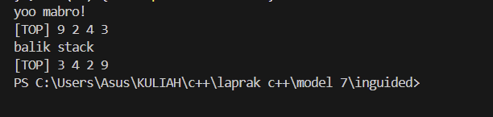
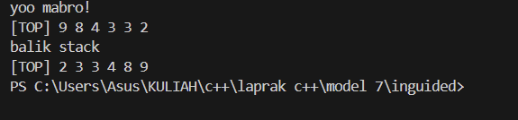
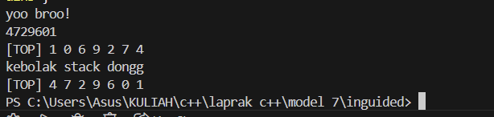

# <h1 align="center">Laporan Praktikum Modul 7 <br> STACK</h1>
<p align="center">elfan endriyanto - 103112430040</p>

## Dasar Teori

C++ adalah bahasa pemrograman tingkat tinggi yang dikembangkan oleh Bjarne Stroustrup pada awal 1980-an di Bell Labs. Dirancang sebagai versi yang lebih lengkap dari bahasa pemrograman C, ada banyak fitur tambahan yang disertakan oleh C++.

Fitur ini termasuk object-oriented programming (OOP), pengelolaan memori secara manual, dan penggunaan template generik. Hasilnya, bahasa pemrograman ini pun menjadi lebih fleksibel dan efisien untuk berbagai kebutuhan.

C++ juga dirancang untuk menangani proyek pemrograman kompleks, termasuk aplikasi dengan performa tinggi seperti sistem operasi dan software grafis. Selain itu, C++ mendukung berbagai gaya pemrograman, mulai dari prosedural, generik, hingga berorientasi objek sehingga cocok untuk pengembangan software skala besar.

Berikut merupakan konsep dasar dalam bahasa C++

### 1. **Variabel**

Variabel adalah tempat penyimpanan data dalam program, yang memiliki nama dan nilai tertentu. Di C++, variabel memiliki tipe data yang menentukan jenis nilai yang bisa disimpan.

Berikut adalah tipe-tipe data yang ada dalam variabel C++:

- bool: singkatan dari tipe data boolean, yang hanya berisi dua nilai, yaitu True atau False.
- char: kependekan dari character, yaitu tipe data huruf dari A sampai Z.
- int: kepanjangannya adalah integer, yaitu tipe berupa angka.
- float dan double: tipe data yang berupa angka pecahan, contohnya 1,33.
- string: tipe data dalam bentuk kumpulan karakter, seperti “bahasa pemrograman C++“.

Selain itu, variabel bisa bersifat konstan dengan kata kunci const, yang artinya nilainya tidak bisa diubah setelah ditentukan. C++ juga mendukung pointer, yaitu variabel yang menyimpan alamat memori sehingga developer bisa mengontrol memori secar langsung.

Penulisan variabel dalam C++ terdiri dari dua langkah, yaitu deklarasi dan inisialisasi.

### 2. **Syntax**

Sintaks merupakan pedoman dan peraturan yang harus diikuti ketika menuliskan baris kode/instruksi dalam bahasa pemrograman. Selain itu, sintaks juga dapat dipandang sebagai kerangka yang menentukan struktur bahasa pemrograman.

Bahasa C++ juga memiliki sintaks untuk fungsi-fungsi yang sudah disediakan. Instruksi yang berbeda memiliki sintaks yang berbeda yang menentukan penggunaannya, tetapi program C++ juga memiliki aturan sintaks dasar yang diikuti di seluruh program.

- #include <iostream> : bagian ini disebut preprocessor directive untuk menyertakan file header.

- <iostream> : memberikan akses ke fungsi input-output standar dalam C++.

- using namespace std : bagian ini disebut deklarasi yang memberi tahu program untuk menggunakan namespace std yang berisi banyak fungsi dan objek standar.

- int main() : bagian ini disebut deklarasi fungsi utama (main) yang merupakan pintu masuk eksekusi untuk program C++.

- { dan } : bagian ini disebut kurung kurawal membuka dan menutup blok baris kode untuk fungsi main.

- Semicolon ( ; ) : setiap baris kode dalam contoh di atas diakhiri dengan simbol titik koma ( ; ). Simbol ini berfungsi sebagai penanda akhir dari setiap baris kode dalam program. Ketika kompiler menemui titik koma ini, proses eksekusi pada baris tersebut dihentikan dan lanjut ke baris kode berikutnya.

- return 0; : bagian ini disebut pernyataan kembalian yang mengindikasikan bahwa program telah selesai dengan sukses, sedangkan 0 adalah kode keluaran yang menunjukkan tidak ada kesalahan.

### 3. **Komentar**

Komentar dalam bahasa pemrograman C++ bertujuan untuk memberikan penjelasan mengenai setiap baris kode dengan tujuan memudahkan pembacaan. Penulisan komentar ini dilakukan untuk menyediakan informasi yang relevan terkait dengan implementasi kode yang sedang dibuat. Praktik ini umum dilakukan oleh para programmer sebagai bagian dari dokumentasi proyek mereka.

### 4. **Operasi Aritmatika**

Aritmatika adalah cabang ilmu matematika yang membahas perhitungan dasar "kabataku", yakni operasi perkalian, pembagian, penambahan dan pengurangan.

Selain keempat operasi di atas, bahasa C++ juga memiliki operasi modulo division, atau operator % yang dipakai untuk mencari sisa hasil bagi.

Berikut merupakan operasi aritmatika yang dapat dilakukan dalam bahasa C++.

- +=: assignment penambahan (Contoh: A += 7 ekuivalen dengan A = A + 7).
- -= : assignment pengurangan.
- \*= : assignment perkalian.
- /= : assignment pembagian.
- %=: assignment mod.

### 5. **Control Structures**

Control structure mengatur alur eksekusi program berdasarkan kondisi tertentu. Ada beberapa control structure utama dalam C++, termasuk if-else untuk percabangan serta for, while, dan do-while untuk loop atau perulangan.

Dengan struktur ini, program bisa memberikan respons yang berbeda tergantung pada input atau kondisi yang terjadi selama runtime. Control structure memastikan efisiensi dalam pemrosesan, terutama saat menangani data besar atau algoritma yang kompleks.

**if**<br>
Statement `if` digunakan untuk mengevaluasi ekspresi logis yang menghasilkan nilai `true` atau `false`. Apabila nilainya `true`, blok kode di dalam `if` akan dieksekusi. Kalau tidak, blok tersebut akan dilewati.

**else if dan else**<br>
Apabila kondisi di dalam `if` bernilai `false`, Anda bisa menggunakan `else if` untuk memeriksa kondisi lainnya. Kalau semua kondisi `if` dan `else if` bernilai `false`, blok `else` akan dijalankan sebagai opsi terakhir.

**for**<br>
Loop `for` digunakan untuk melakukan pengulangan dengan jumlah yang diketahui. Struktur ini mencakup **inisialisasi**, **kondisi**, dan **inkrementasi/dekrementasi** dalam satu baris.

Contohnya adalah sebagai berikut:

```c++
...
int main() {
for (int i = 0; i < 5; i++) {
    cout << "Perulangan ke-" << i << endl;
}
```

Pada contoh di atas, variabel `i` diinisialisasi dengan nilai 0. Loop akan berulang selama `i < 5`, dan setiap kali loop berakhir, nilai `i` akan bertambah 1. Pengulangan akan berhenti saat kondisi `i < 5` tidak lagi terpenuhi.

**while**<br>
Loop `while` akan terus mengeksekusi blok kode selama ekspresi kondisional bernilai `true`. Pengulangan akan berhenti begitu kondisi menjadi `false`.

**do-while**<br>
Dengan `do-while`, blok kode akan dieksekusi minimal satu kali, bahkan meskipun kondisinya bernilai `false` saat pemeriksaan pertama. Setelah satu kali eksekusi, kondisi akan diperiksa untuk menentukan apakah loop akan dijalankan lagi.

### 6. **Function**

Sebuah Function dalam C++ adalah blok kode yang dapat menerima input (dalam bentuk parameter) dari pemanggilnya, melakukan serangkaian operasi, dan secara opsional mengembalikan nilai sebagai output. Function sangat berguna untuk mengorganisir kode secara terstruktur dan dapat digunakan kembali.

**Deklarasi Function**<br>
Sebuah deklarasi Function minimal terdiri dari tipe pengembalian, nama Function, dan daftar parameter.

**Definisi Function**<br>
Definisi Function terdiri dari deklarasi dan body Function. Body Function adalah bagian dari Function yang berisi kode yang akan dieksekusi ketika Function dipanggil.

**Parameter dan Argumen**<br>
Sebuah Function memiliki daftar parameter yang memungkinkan pemanggil untuk meneruskan argumen ke dalam Function. Argumen adalah nilai konkret yang dilewatkan ke Function. Anda dapat menggunakan referensi atau nilai untuk mem-pass argumen ke dalam Function.

**Jenis Return**<br>
Jenis return function merujuk pada nilai yang dikembalikan oleh suatu fungsi setelah melakukan operasi atau pemrosesan tertentu. Dalam bahasa pemrograman C++, sebuah function dapat mengembalikan berbagai jenis nilai tergantung pada kebutuhan dan logika programnya.

### 7. **Array**

Array merupakan struktur data yang digunakan untuk `menyimpan sekumpulan data` dalam satu tempat. Setiap data dalam Array memiliki indeks, sehingga kita akan mudah memprosesnya.

Indeks array selalu dimulai dari angka nol (`0`). Pada teori struktur data ukuran array akan bergantung dari banyaknya data yang disimpan di dalamnya.

**Cara Membuat Array pada C++**<br>
Pada C++, array dapat kita buat dengan cara seperti ini.

```c++
// membuat array kosong dengan tipe data integer dan panjang 10
int nama_array[10];

// membuat array dengan langsung diisi
int nama_arr[3] = {0, 3, 2}
```

Cara membuat array hampir sama seperti cara membuat variabel biasa. Bedanya pada array kita harus menentukan panjangnya.

**Cara Mengambil Data dari Array**<br>
Seperti yang sudah kita ketahui, array akan menyimpan sekumpulan data dan memberinya nomer indeks agar mudah diakses. Indeks array selalu dimulai dari nol `0`.

Misalkan kita punya array seperti ini: <br>
`char huruf[5] = {'a', 'b', 'c', 'd', 'e'};`<br>
Bagaimana cara mengambil huruf `c`?

Jawabannya:
`huruf[2];`

**Mengisi Ulang Data Array**<br>
Data pada array dapat kita isi ulang dengan cara seperti ini:<br>
`huruf[2] = 'z';`<br>
Maka isi array `huruf` pada indeks ke-2 akan bernilai z`.

### 8. **Linked List**

Dalam C++, linked list merupakan struktur data linear yang memungkinkan user untuk menyimpan data di lokasi memory yang tidak berurutan. Sebuah linked list didefinisikan sebagai sekumpulan nodes yang dimana tiap node memiliki 2 anggota: value node itu sendiri dan petunjuk next/previous yang menyimpan alamat node berikutnya/sebelumnya.

**Representasi Linked List dalam C++**<br>
Dalam C++, linked list pada dasarnya direpresentasikan oleh pointer ke node pertama, yang umumnya disebut sebagai "**head**" dari list tersebut. Setiam node dalam list didefinisikan oleh struktur yang mencakup data field dan pointer yang mengarah ke struktur dengan tipe yang sama. Jenis struktur ini dikenal sebagai struktur self-referential.

**Singly Linked List**<br>
Singly linked List adalah bentuk paling sederhana dari linked list, di mana setiap node mengandung 2 anggota yaitu data dan next pointer yang menyimpan alamat node berikutnya. Setiap node dalam singly linked list terhubung melalui petunjuk berikutnya, dan penunjuk beriutnya dari node terakhir mengarah ke NULL, yang menandakan akhir dari linked list. Diagram berikut menggambarkan struktur singly linked list: <br>
![Diagram singly linked list]


**Doubly Linked List**<br>
Doubly Linked List adalah jenis linked list yang di mana setiap node mengandung 3 bagian: data, pointer ke node berikutnya, dan pointer ke node sebelumnya. Struktur ini memungkinkan penelusuran daftar ke arah depan dan belakang, berbeda dengan Singly Linked List yang hanya dapat ditelusuri ke arah depan.
![Diagram doubly linked list]


### 9. **Stack**

Kontainer stack mengikuti urutan LIFO (Last In First Out) untuk proses insert dan delete. Artinya, elemen yang dimasukkan paling akhir akan dihapus terlebih dahulu, dan elemen yang dimasukkan paling awal akan dihapus terakhir. Hal ini dilakukan dengan insert dan delete elemen hanya pada satu sisi stack yang umumnya disebut sebagai top (puncak) dari stack.

**Operasi dasar Stack**

**1. Inserting Elements**<br>
Dalam stack, elemen baru hanya bisa di-insert di bagian top dari stack dengan menggunakan method push().

**2. Accessing Elements**<br>
Hanya elemen di bagian top dari stack yang bisa diakses menggunakan method top().

**3. Deleting Elements**<br>
Dalam stack, hanya elemen di bagian top yang bisa di-delete menggunakan method pop() dalam satu operasi.

**4. empty()**<br>
Method ini mengecek apakah stack kosong. Method ini mengembalikan true jika stack tidak memiliki elemen; jika tidak, method ini mengembalikan false.

**5. Size of stack**<br>
Function size() pada stack mengembalikan jumlah elemen yang sedang ada di dalam stack. Function ini membantu mengetahui berapa banyak item yang tersimpan tanpa memodifikasi stack.

## Guided

### Soal Stack.cpp

```go
#include <iostream>
using namespace std;

struct Node {
    int data;
    Node* next;
};

bool isEmpty(Node* top) {
    return top == nullptr;
}

void push(Node *&top, int data) {
    Node* newNode = new Node();
    newNode->data = data;
    newNode->next = top;
    top = newNode;
}

int pop(Node *&top) {
    if (isEmpty(top)) {
        cout << "Stack kosong. tidak bisa pop!." << endl;
        return 0;
    }

    int poppedData = top->data;
    Node* temp = top;
    top = top->next;

    delete temp;
    return poppedData;
}

void show(Node *top) {
    if (isEmpty(top)) {
        cout << "Stack kosong." << endl;
        return;
    }

    cout << "TOP -> ";
    Node* temp = top;

    while (temp != nullptr) {
        cout << temp->data << " -> ";
        temp = temp->next;
    }

    cout << "NULL" << endl;
}

int main()
{
    Node* stack = nullptr;

    push(stack, 10);
    push(stack, 20);
    push(stack, 30);

    cout << "Menampilkan isi stack: " << endl;
    show(stack);

    cout << "Pop: " << pop(stack) << endl;

    cout << "Menampilkan sisa stack: " << endl;
    show(stack);

    return 0;
}
```
> Output

>

penjelasan kode

Program ini mengimplementasikan **stack menggunakan linked list**, di mana **push** menambahkan elemen di atas stack, **pop** menghapus elemen teratas, dan **show** menampilkan isi stack dari atas ke bawah, sehingga terlihat bahwa elemen terakhir yang dimasukkan (30) keluar pertama saat pop dijalankan, sesuai prinsip **LIFO (Last In, First Out)**.

## Unguided

### Soal 1,1 Stack.h

```go
#ifndef STACK_H
#define STACK_H

typedef int infotype;

struct Stack {
    infotype info[20];
    int top;
};

void createStack(Stack &S);
void push(Stack &S, infotype x);
infotype pop(Stack &S);
void printInfo(Stack S);
void balikStack(Stack &S);
void getInputStream(Stack &S);

#endif


```
penjelasan kode

Kode STACK_H ini merupakan ADT stack sederhana yang menggunakan array untuk menyimpan data bertipe integer. Struktur Stack memiliki array info sebagai tempat penyimpanan elemen dan variabel top untuk menandai posisi elemen teratas. Di dalam header ini disediakan beberapa operasi dasar stack, seperti membuat stack kosong, menambahkan data ke stack (push), mengambil data teratas (pop), menampilkan isi stack, membalik urutan stack, serta memasukkan data ke stack melalui aliran input.

### Soal 1,2 Stack.cpp

```go
#include <iostream>
#include "stack.h"
using namespace std;

void createStack(Stack &S) {
    S.top = -1;
}

void push(Stack &S, infotype x) {
    if (S.top < 19) {
        S.top++;
        S.info[S.top] = x;
    }
}

infotype pop(Stack &S) {
    if (S.top >= 0) {
        infotype x = S.info[S.top];
        S.top--;
        return x;
    }
    return -1;
}

void printInfo(Stack S) {
    cout << "[TOP] ";
    for (int i = S.top; i >= 0; i--) {
        cout << S.info[i] << " ";
    }
    cout << endl;
}

void balikStack(Stack &S) {
    Stack T;
    createStack(T);
    while (S.top >= 0) {
        push(T, pop(S));
    }
    S = T;
}

void pushAscending(Stack &S, infotype x) {
    if (S.top < 0) {
        push(S, x);
        return;
    }
    int i = S.top;
    while (i >= 0 && S.info[i] > x) {
        S.info[i + 1] = S.info[i];
        i--;
    }
    S.info[i + 1] = x;
    S.top++;
}

void getInputStream(Stack &S) {
    char c;
    while (true) {
        c = cin.get();
        if (c == '\n') break;
        push(S, int(c - '0'));
    }
}

```
penjelasan kode

Kode stack.cpp ini merupakan implementasi ADT stack berbasis array dengan kapasitas maksimal 20 elemen. Program ini menyediakan operasi dasar stack seperti membuat stack kosong, menambahkan data ke stack (push), mengambil data teratas (pop), dan menampilkan isi stack dari elemen teratas ke bawah. Selain itu, terdapat fungsi untuk membalik urutan stack dengan bantuan stack sementara, memasukkan data secara terurut menaik, serta membaca input karakter dari keyboard dan menyimpannya ke dalam stack dalam bentuk angka. Secara keseluruhan, kode ini digunakan untuk mengelola data stack secara sederhana sesuai konsep LIFO (Last In First Out).

### Soal 1,3 main1.cpp

```go
#include <iostream>
#include "stack.h"
#include "stack.cpp"
using namespace std;

int main() {
    cout << "yoo mabro!" << endl;
    Stack S;
    createStack(S);
    push(S, 3);
    push(S, 4);
    push(S, 8);
    pop(S);
    push(S, 2);
    push(S, 3);
    pop(S);
    push(S, 9);
    printInfo(S);
    cout << "balik stack" << endl;
    balikStack(S);
    printInfo(S);

    return 0;
}

```
> Output

> 

penjelasan kode

Program main.cpp ini menunjukkan cara kerja stack dengan operasi push, pop, dan pembalikan stack. Dari output terlihat bahwa setelah beberapa kali push dan pop, isi stack terakhir adalah 9 2 4 3 dengan 9 sebagai elemen paling atas (TOP), sesuai prinsip LIFO. Ketika fungsi balikStack dipanggil, urutan elemen stack dibalik sehingga elemen yang awalnya paling bawah menjadi paling atas, menghasilkan output 3 4 2 9. Ini menandakan bahwa fungsi pembalikan stack bekerja dengan benar.

### Soal 1,4 main2.cpp

```go
#include <iostream>
#include "stack.h"
#include "stack.cpp"
using namespace std;

int main() {
    cout << "yoo mabro!" << endl;
    Stack S;
    createStack(S);
    pushAscending(S, 3);
    pushAscending(S, 4);
    pushAscending(S, 8);
    pushAscending(S, 2);
    pushAscending(S, 3);
    pushAscending(S, 9);
    printInfo(S);
    cout << "balik stack" << endl;
    balikStack(S);
    printInfo(S);

    return 0;
}

```
> Output

> 

penjelasan kode

Program main.cpp ini digunakan untuk menguji stack dengan metode pushAscending, yaitu memasukkan data ke dalam stack agar tetap tersusun secara terurut. Dari output terlihat bahwa setelah semua data dimasukkan, isi stack ditampilkan dari elemen teratas ke bawah sehingga urutannya menjadi 9 8 4 3 3 2, dengan 9 sebagai TOP. Ketika fungsi balikStack dijalankan, urutan elemen stack dibalik sehingga elemen terkecil berada di posisi TOP dan hasil akhirnya menjadi 2 3 3 4 8 9. Hal ini menunjukkan bahwa proses penyusunan menaik dan pembalikan stack telah berjalan dengan benar.

### Soal 1,5 main3.cpp

```go
#include <iostream>
#include "stack.h"
#include "stack.cpp"
using namespace std;

int main() {
    cout << "yoo broo!" << endl;

    Stack S;
    createStack(S);

    getInputStream(S);
    printInfo(S);

    cout << "kebolak stack dongg" << endl;
    balikStack(S);
    printInfo(S);

    return 0;
}

```
> Output

> 

penjelasan kode

Program main.cpp ini digunakan untuk menguji fungsi getInputStream pada ADT stack. Saat program dijalankan, pengguna memasukkan deretan angka dalam satu baris (misalnya 4729601), lalu setiap digit dibaca satu per satu dan dimasukkan ke dalam stack sebagai elemen bertipe integer. Karena stack bekerja dengan prinsip LIFO, hasil printInfo pertama menampilkan elemen dari digit terakhir yang dimasukkan sebagai TOP, yaitu 1 0 6 9 2 7 4. Setelah itu, fungsi balikStack dipanggil untuk membalik urutan stack, sehingga elemen yang semula berada di bawah berpindah ke atas, dan hasil akhirnya menjadi 4 7 2 9 6 0 1. Output ini menunjukkan bahwa proses input stream dan pembalikan stack sudah berjalan dengan benar.


## Referensi

1. _Hostinger_. https://www.hostinger.com/id/tutorial/bahasa-pemrograman-cpp. Diakses pada 03 Oktober 2025.
2. _Dicoding_. https://www.dicoding.com/blog/memahami-esensi-bahasa-pemrograman-c/. Diakses pada 03 Oktober 2025.
3. _Duniailkom_. https://www.duniailkom.com/tutorial-belajar-c-plus-plus-jenis-jenis-operator-aritmatika-bahasa-c-plus-plus/. Diakses pada 03 Oktober 2025.
4. _kodingakademi_. https://www.kodingakademi.id/function-c-panduan-lengkap/. Diakses pada 03 Oktober 2025.
5. _petanikode_ . https://www.petanikode.com/cpp-array/. Diakses pada 06 Oktober 2025.
6. _GeekForGeeks_. https://www.geeksforgeeks.org/cpp/cpp-linked-list/. Diakses pada 13 Oktober 2025.
7. _GeekForGeeks_. https://www.geeksforgeeks.org/cpp/doubly-linked-list-in-cpp/. Diakses pada 27 Oktober 2025.
8. _GeekForGeeks_. https://www.geeksforgeeks.org/cpp/stack-in-cpp-stl/. Diakses pada 4 November 2025.
