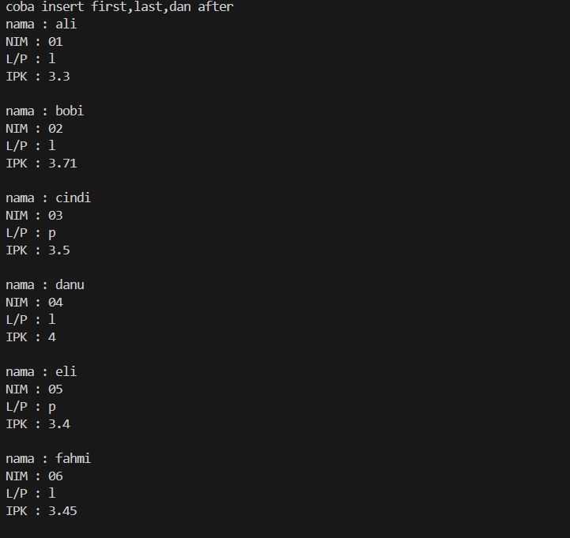
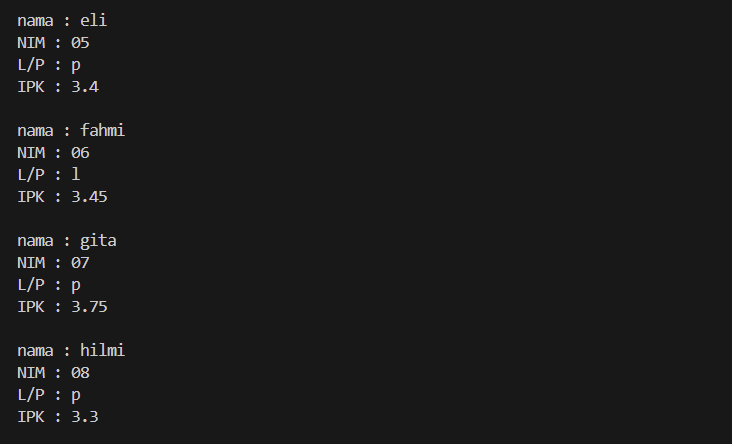
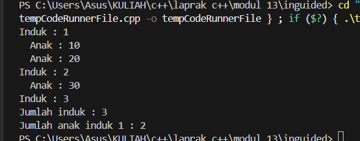

# <h1 align="center">Laporan Praktikum Modul 13 <br>  CODE BLOCKS IDE & PENGENALAN BAHASA C++</h1>
<p align="center">elfan endriyanto - 103112430040</p>

## Dasar Teori

Bahasa pemrograman C++ adalah salah satu bahasa tingkat tinggi yang banyak dimanfaatkan baik di lingkungan pendidikan maupun industri. Pada umumnya, susunan program C++ diawali dengan header file seperti #include, yang berfungsi untuk mendukung proses input dan output standar. Menurut pendapat Indahyati dan Rahmawati (2020), C++ menjadi dasar penting dalam memahami konsep algoritma serta pemrograman, terutama karena struktur sintaksnya relatif sederhana dan mudah dipahami oleh pemula.


## Guided

### soal 1

aku mengerjakan perulangan

## Unguided

### Soal 1,1 circularlist.h

```go
#ifndef CIRCULARLIST_H
#define CIRCULARLIST_H

#include <string>
using namespace std;

#define Nil NULL

typedef struct mahasiswa {
    string nama;
    string nim;
    char jenis_kelamin;
    float ipk;
} infotype;

typedef struct ElmList *address;

typedef struct ElmList {
    infotype info;
    address next;
} ElmList;

typedef struct {
    address First;
} List;

void createList(List &L);
address alokasi(infotype x);
void dealokasi(address &P);

void insertFirst(List &L, address P);
void insertAfter(List &L, address Prec, address P);
void insertLast(List &L, address P);
void insertSortedByNIM(List &L, address P);

address findElm(List L, infotype x);
void printInfo(List L);

#endif


```
penjelasan kode

Kode circularlist.cpp ini merupakan implementasi Abstract Data Type (ADT) circular singly linked list yang digunakan untuk menyimpan dan mengelola data mahasiswa. Program ini menyediakan fungsi untuk membuat list kosong, melakukan alokasi dan dealokasi node, serta mengatur berbagai operasi penyisipan data, seperti penyisipan di awal list, di akhir list, setelah node tertentu, dan penyisipan secara terurut berdasarkan NIM. Karena struktur list bersifat circular, node terakhir selalu menunjuk kembali ke node pertama, sehingga proses penelusuran data dilakukan secara berulang hingga kembali ke elemen First. Selain itu, program ini juga dilengkapi dengan fungsi pencarian data mahasiswa berdasarkan NIM serta fungsi untuk menampilkan seluruh isi list secara terstruktur dan mudah dibaca. Dengan implementasi ini, keterhubungan antar data tetap terjaga secara melingkar dan pengolahan data mahasiswa dapat dilakukan secara efisien sesuai kebutuhan.

### Soal 1,2 circularlist.cpp

```go

#include "circularlist.h"
#include <iostream>
using namespace std;

void createList(List &L) {
    L.First = Nil;
}

address alokasi(infotype x) {
    address P = new ElmList;
    P->info = x;
    P->next = Nil;
    return P;
}

void dealokasi(address &P) {
    delete P;
    P = Nil;
}

void insertFirst(List &L, address P) {
    if (L.First == Nil) {
        L.First = P;
        P->next = P;
    } else {
        address Q = L.First;
        while (Q->next != L.First) {
            Q = Q->next;
        }
        P->next = L.First;
        Q->next = P;
        L.First = P;
    }
}

void insertLast(List &L, address P) {
    if (L.First == Nil) {
        insertFirst(L, P);
    } else {
        address Q = L.First;
        while (Q->next != L.First) {
            Q = Q->next;
        }
        Q->next = P;
        P->next = L.First;
    }
}

void insertAfter(List &L, address Prec, address P) {
    if (Prec != Nil) {
        P->next = Prec->next;
        Prec->next = P;
    }
}

void insertSortedByNIM(List &L, address P) {
    address Q;
    if (L.First == Nil) {
        insertFirst(L, P);
    } else if (P->info.nim < L.First->info.nim) {
        insertFirst(L, P);
    } else {
        Q = L.First;
        while (Q->next != L.First &&
               Q->next->info.nim < P->info.nim) {
            Q = Q->next;
        }
        insertAfter(L, Q, P);
    }
}

address findElm(List L, infotype x) {
    address P = L.First;
    if (P != Nil) {
        do {
            if (P->info.nim == x.nim) {
                return P;
            }
            P = P->next;
        } while (P != L.First);
    }
    return Nil;
}

void printInfo(List L) {
    address P = L.First;
    if (P != Nil) {
        do {
            cout << "nama : " << P->info.nama << endl;
            cout << "NIM : " << P->info.nim << endl;
            cout << "L/P : " << P->info.jenis_kelamin << endl;
            cout << "IPK : " << P->info.ipk << endl << endl;
            P = P->next;
        } while (P != L.First);
    }
}

```
penjelasan kode

Kode circularlist.cpp ini merupakan implementasi ADT circular singly linked list untuk menyimpan data mahasiswa. Program ini mengatur pembuatan list kosong, alokasi dan dealokasi node, serta berbagai operasi penyisipan data seperti insert di awal, di akhir, setelah node tertentu, dan penyisipan terurut berdasarkan NIM. Karena bersifat circular, node terakhir selalu menunjuk kembali ke node pertama sehingga penelusuran list dilakukan dengan perulangan sampai kembali ke First. Selain itu, tersedia fungsi pencarian data mahasiswa berdasarkan NIM dan fungsi untuk menampilkan seluruh isi list dengan format yang rapi. Implementasi ini memastikan data tetap terhubung secara melingkar dan dapat ditampilkan secara berurutan sesuai kebutuhan.

### Soal 1,3 main1.cpp

```go
#include <iostream>
#include "circularlist.h"
#include "circularlist.cpp"
using namespace std;

address createData(string nama, string nim, char jenis_kelamin, float ipk) {
    infotype x;
    x.nama = nama;
    x.nim = nim;
    x.jenis_kelamin = jenis_kelamin;
    x.ipk = ipk;
    return alokasi(x);
}

int main() {
    List L;
    address P;

    createList(L);
    cout << "coba insert first,last,dan after" << endl;

    P = createData("ali", "01", 'l', 3.3);
    insertSortedByNIM(L, P);

    P = createData("bobi", "02", 'l', 3.71);
    insertSortedByNIM(L, P);

    P = createData("cindi", "03", 'p', 3.5);
    insertSortedByNIM(L, P);

    P = createData("danu", "04", 'l', 4.0);
    insertSortedByNIM(L, P);

    P = createData("eli", "05", 'p', 3.4);
    insertSortedByNIM(L, P);

    P = createData("fahmi", "06", 'l', 3.45);
    insertSortedByNIM(L, P);

    P = createData("gita", "07", 'p', 3.75);
    insertSortedByNIM(L, P);

    P = createData("hilmi", "08", 'p', 3.3);
    insertSortedByNIM(L, P);

    printInfo(L);
    return 0;
}

```
> Output

> 

> 

penjelasan kode
Program circular list ini digunakan untuk menyimpan data mahasiswa dan melakukan penyisipan secara terurut berdasarkan NIM. Data mahasiswa dibuat terlebih dahulu menggunakan fungsi createData, lalu dimasukkan ke dalam list dengan insertSortedByNIM sehingga urutan data otomatis rapi dari NIM terkecil ke terbesar. Karena list bersifat circular, elemen terakhir akan menunjuk kembali ke elemen pertama, namun saat ditampilkan menggunakan printInfo, data ditelusuri satu putaran penuh sehingga semua mahasiswa tercetak dengan lengkap. Dari output terlihat bahwa seluruh data berhasil disimpan dan ditampilkan sesuai urutan NIM tanpa terputus.

### Soal 2,1 multilist.h

```go
#ifndef MULTILIST_H
#define MULTILIST_H

#define Nil NULL

typedef int infotypeinduk;
typedef int infotypeanak;

typedef struct elemen_list_induk *address;
typedef struct elemen_list_anak *address_anak;

struct elemen_list_anak {
    infotypeanak info;
    address_anak next;
    address_anak prev;
};

struct listanak {
    address_anak first;
    address_anak last;
};

struct elemen_list_induk {
    infotypeinduk info;
    listanak lanak;
    address next;
    address prev;
};

struct listinduk {
    address first;
    address last;
};

bool ListEmpty(listinduk L);
bool ListEmptyAnak(listanak L);

void CreateList(listinduk &L);
void CreateListAnak(listanak &L);

address alokasi(infotypeinduk x);
address_anak alokasiAnak(infotypeanak x);

void dealokasi(address &P);
void dealokasiAnak(address_anak &P);

address findElm(listinduk L, infotypeinduk x);
address_anak findElmAnak(listanak L, infotypeanak x);

void insertFirst(listinduk &L, address P);
void insertLast(listinduk &L, address P);
void insertAfter(listinduk &L, address Prec, address P);

void insertFirstAnak(listanak &L, address_anak P);
void insertLastAnak(listanak &L, address_anak P);
void insertAfterAnak(listanak &L, address_anak Prec, address_anak P);

void delFirst(listinduk &L, address &P);
void delLast(listinduk &L, address &P);

void printInfo(listinduk L);
void printInfoAnak(listanak L);

int nbList(listinduk L);
int nbListAnak(listanak L);

#endif

```

penjelasan kode
Kode multilist.h ini merupakan definisi Abstract Data Type (ADT) multilist yang digunakan untuk merepresentasikan hubungan antara list induk dan list anak. Struktur ini memungkinkan setiap elemen pada list induk memiliki sebuah list anak tersendiri, sehingga cocok digunakan untuk memodelkan relasi satu ke banyak. Program ini mendefinisikan tipe data, struktur node induk dan anak, serta pengelolaan pointer next dan prev yang menunjukkan bahwa multilist ini menggunakan double linked list baik pada level induk maupun anak. Selain itu, tersedia berbagai operasi dasar seperti pembuatan list, pengecekan list kosong, alokasi dan dealokasi node, pencarian elemen, penyisipan data di awal, akhir, dan setelah node tertentu, penghapusan data, pencetakan isi list, serta perhitungan jumlah elemen pada list induk dan anak. Dengan adanya struktur dan fungsi-fungsi tersebut, ADT multilist ini mampu mengelola data bertingkat secara terstruktur, fleksibel, dan efisien.

### Soal 2,2 multilist.cpp

```go
#include "multilist.h"
#include <iostream>
using namespace std;

bool ListEmpty(listinduk L) {
    return L.first == Nil && L.last == Nil;
}

bool ListEmptyAnak(listanak L) {
    return L.first == Nil && L.last == Nil;
}

void CreateList(listinduk &L) {
    L.first = Nil;
    L.last = Nil;
}

void CreateListAnak(listanak &L) {
    L.first = Nil;
    L.last = Nil;
}

address alokasi(infotypeinduk x) {
    address P = new elemen_list_induk;
    P->info = x;
    P->next = Nil;
    P->prev = Nil;
    CreateListAnak(P->lanak);
    return P;
}

address_anak alokasiAnak(infotypeanak x) {
    address_anak P = new elemen_list_anak;
    P->info = x;
    P->next = Nil;
    P->prev = Nil;
    return P;
}

void dealokasi(address &P) {
    delete P;
    P = Nil;
}

void dealokasiAnak(address_anak &P) {
    delete P;
    P = Nil;
}

address findElm(listinduk L, infotypeinduk x) {
    address P = L.first;
    while (P != Nil && P->info != x) {
        P = P->next;
    }
    return P;
}

address_anak findElmAnak(listanak L, infotypeanak x) {
    address_anak P = L.first;
    while (P != Nil && P->info != x) {
        P = P->next;
    }
    return P;
}

void insertFirst(listinduk &L, address P) {
    if (ListEmpty(L)) {
        L.first = P;
        L.last = P;
    } else {
        P->next = L.first;
        L.first->prev = P;
        L.first = P;
    }
}

void insertLast(listinduk &L, address P) {
    if (ListEmpty(L)) {
        insertFirst(L, P);
    } else {
        P->prev = L.last;
        L.last->next = P;
        L.last = P;
    }
}

void insertAfter(listinduk &L, address Prec, address P) {
    if (Prec != Nil) {
        P->next = Prec->next;
        P->prev = Prec;
        if (Prec->next != Nil) {
            Prec->next->prev = P;
        } else {
            L.last = P;
        }
        Prec->next = P;
    }
}

void insertFirstAnak(listanak &L, address_anak P) {
    if (ListEmptyAnak(L)) {
        L.first = P;
        L.last = P;
    } else {
        P->next = L.first;
        L.first->prev = P;
        L.first = P;
    }
}

void insertLastAnak(listanak &L, address_anak P) {
    if (ListEmptyAnak(L)) {
        insertFirstAnak(L, P);
    } else {
        P->prev = L.last;
        L.last->next = P;
        L.last = P;
    }
}

void insertAfterAnak(listanak &L, address_anak Prec, address_anak P) {
    if (Prec != Nil) {
        P->next = Prec->next;
        P->prev = Prec;
        if (Prec->next != Nil) {
            Prec->next->prev = P;
        } else {
            L.last = P;
        }
        Prec->next = P;
    }
}

void delFirst(listinduk &L, address &P) {
    if (!ListEmpty(L)) {
        P = L.first;
        if (L.first == L.last) {
            L.first = Nil;
            L.last = Nil;
        } else {
            L.first = P->next;
            L.first->prev = Nil;
        }
        P->next = Nil;
    }
}

void delLast(listinduk &L, address &P) {
    if (!ListEmpty(L)) {
        P = L.last;
        if (L.first == L.last) {
            L.first = Nil;
            L.last = Nil;
        } else {
            L.last = P->prev;
            L.last->next = Nil;
        }
        P->prev = Nil;
    }
}

void printInfo(listinduk L) {
    address P = L.first;
    while (P != Nil) {
        cout << "Induk : " << P->info << endl;
        printInfoAnak(P->lanak);
        P = P->next;
    }
}

void printInfoAnak(listanak L) {
    address_anak P = L.first;
    while (P != Nil) {
        cout << "  Anak : " << P->info << endl;
        P = P->next;
    }
}

int nbList(listinduk L) {
    int n = 0;
    address P = L.first;
    while (P != Nil) {
        n++;
        P = P->next;
    }
    return n;
}

int nbListAnak(listanak L) {
    int n = 0;
    address_anak P = L.first;
    while (P != Nil) {
        n++;
        P = P->next;
    }
    return n;
}


```
penjelasan kode

Kode multilist.h ini merupakan ADT multilist yang digunakan untuk mengelola hubungan antara list induk dan list anak, di mana setiap data induk dapat memiliki beberapa data anak. Struktur ini menggunakan double linked list pada induk dan anak, serta menyediakan operasi dasar seperti pembuatan list, alokasi dan dealokasi node, pencarian, penyisipan, penghapusan, penampilan data, dan perhitungan jumlah elemen. ADT ini memungkinkan pengelolaan data bertingkat secara rapi dan terstruktur.

### Soal 2,3 main2.cpp

```go
#include <iostream>
#include "multilist.h"
#include "multilist.cpp"
using namespace std;

int main() {
    listinduk L;
    CreateList(L);

    address P1 = alokasi(1);
    address P2 = alokasi(2);
    address P3 = alokasi(3);

    insertLast(L, P1);
    insertLast(L, P2);
    insertLast(L, P3);

    address_anak A1 = alokasiAnak(10);
    address_anak A2 = alokasiAnak(20);
    address_anak A3 = alokasiAnak(30);

    insertLastAnak(P1->lanak, A1);
    insertLastAnak(P1->lanak, A2);
    insertLastAnak(P2->lanak, A3);

    printInfo(L);

    cout << "Jumlah induk : " << nbList(L) << endl;
    cout << "Jumlah anak induk 1 : " << nbListAnak(P1->lanak) << endl;

    return 0;
}

```
> Output

> 

penjelasan kode
Program multilist ini merupakan implementasi struktur data multi linked list yang digunakan untuk merepresentasikan hubungan satu ke banyak (one-to-many) antara data induk dan data anak. Pada program utama, dibuat sebuah list induk yang kemudian diisi dengan tiga elemen induk. Setiap elemen induk memiliki list anak sendiri yang awalnya kosong. Selanjutnya, beberapa elemen anak dialokasikan dan dimasukkan ke list anak dari induk tertentu, sehingga satu induk dapat memiliki lebih dari satu anak, sementara induk lain bisa saja tidak memiliki anak. Fungsi printInfo digunakan untuk menampilkan seluruh data induk beserta anak-anak yang terhubung dengannya, sedangkan fungsi nbList dan nbListAnak digunakan untuk menghitung jumlah elemen induk serta jumlah elemen anak pada induk tertentu. Hasil keluaran menunjukkan bahwa struktur multilist mampu mengelola data secara hierarkis dan terorganisir dengan baik sesuai konsep relasi one-to-many.

## Referensi

1. https://en.wikipedia.org/wiki/Data_structure (diakses blablabla)
