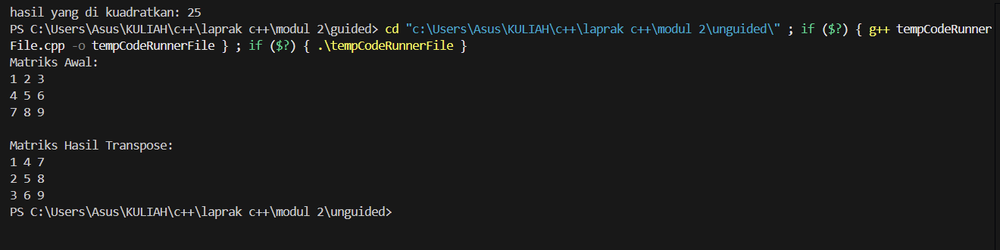
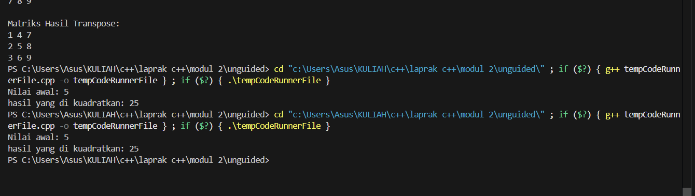

# <h1 align="center">Laporan Praktikum Modul 2 <br>  CODE BLOCKS IDE & PENGENALAN BAHASA C++</h1>
<p align="center">elfan endriyanto - 103112430040</p>

## Dasar Teori

Bahasa pemrograman C++ adalah salah satu bahasa tingkat tinggi yang banyak dimanfaatkan baik di lingkungan pendidikan maupun industri. Pada umumnya, susunan program C++ diawali dengan header file seperti #include, yang berfungsi untuk mendukung proses input dan output standar. Menurut pendapat Indahyati dan Rahmawati (2020), C++ menjadi dasar penting dalam memahami konsep algoritma serta pemrograman, terutama karena struktur sintaksnya relatif sederhana dan mudah dipahami oleh pemula.


## Guided

### soal 1

aku mengerjakan perulangan

## Unguided

### Soal 1

```go
#include <iostream>
using namespace std;

int main() {
    int matriks[3][3] = {
        {1, 2, 3},
        {4, 5, 6},
        {7, 8, 9}
    };

    int transpose[3][3];

    for (int i = 0; i < 3; i++) {
        for (int j = 0; j < 3; j++) {
            transpose[j][i] = matriks[i][j];
        }
    }

    cout << "Matriks Awal:" << endl;
    for (int i = 0; i < 3; i++) {
        for (int j = 0; j < 3; j++) {
            cout << matriks[i][j] << " ";
        }
        cout << endl;
    }

    cout << "\nMatriks Hasil Transpose:" << endl;
    for (int i = 0; i < 3; i++) {
        for (int j = 0; j < 3; j++) {
            cout << transpose[i][j] << " ";
        }
        cout << endl;
    }

    return 0;
}


```

> Output
> 

Pada program ini, saya diminta membuat program untuk menampilkan hasil transpose dari sebuah matriks berukuran 3x3. Program mendeklarasikan dua array dua dimensi, yaitu matriks sebagai data awal dan transpose untuk menampung hasil transpose. Proses transpose dilakukan dengan menukar posisi elemen matriks menggunakan perulangan bersarang, di mana nilai matriks[i][j] dipindahkan ke transpose[j][i]. Setelah itu, program menampilkan matriks awal dan hasil transposenya ke layar. Program ini menunjukkan cara sederhana melakukan operasi transpose pada matriks menggunakan array dua dimensi di C++.

### Soal 2

```go
#include <iostream>
using namespace std;

void kuadratkan(int &n) {
    n = n * n;
}

int main() {
    int nilai = 5; 

    cout << "Nilai awal: " << nilai << endl;

    kuadratkan(nilai);

    cout << "hasil yang di kuadratkan: " << nilai << endl;

    return 0;
}


```

> Output
> 

penjelasan kode

Pada program ini, saya diminta membuat fungsi untuk mengkuadratkan sebuah bilangan menggunakan parameter referensi. Program mendeklarasikan fungsi kuadratkan(int &n) yang menerima parameter n dengan tanda &, artinya nilai variabel yang dikirim akan langsung berubah di memori aslinya. Di dalam fungsi, nilai n dikalikan dengan dirinya sendiri (n = n * n) untuk menghasilkan nilai kuadrat. Pada fungsi main, variabel nilai diinisialisasi dengan angka 5, kemudian ditampilkan nilai awalnya. Setelah fungsi kuadratkan dipanggil, nilai nilai menjadi 25 karena proses pengkuadratan dilakukan secara langsung melalui referensi. Program ini menunjukkan penggunaan parameter referensi untuk memodifikasi nilai variabel dari luar fungsi.

## Referensi

1. https://en.wikipedia.org/wiki/Data_structure (diakses blablabla)

