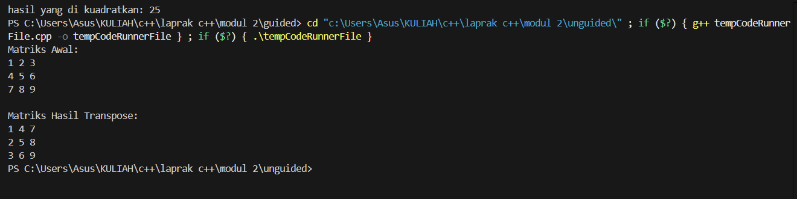
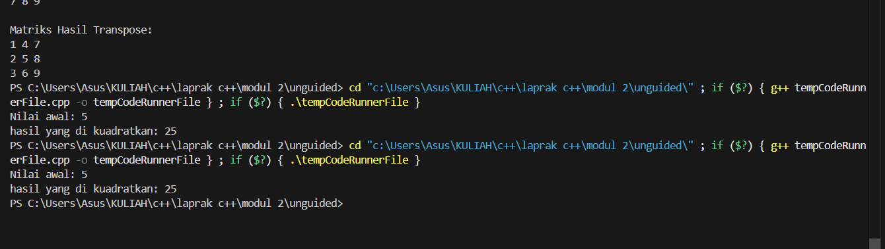

# <h1 align="center">Laporan Praktikum Modul 2 <br> PENGENALAN BAHASA C++ (BAGIAN KEDUA)</h1>
<p align="center">elfan endriyanto - 103112430040</p>

## Dasar Teori

C++ adalah bahasa pemrograman tingkat tinggi yang dikembangkan oleh Bjarne Stroustrup pada awal 1980-an di Bell Labs. Dirancang sebagai versi yang lebih lengkap dari bahasa pemrograman C, ada banyak fitur tambahan yang disertakan oleh C++.

Fitur ini termasuk object-oriented programming (OOP), pengelolaan memori secara manual, dan penggunaan template generik. Hasilnya, bahasa pemrograman ini pun menjadi lebih fleksibel dan efisien untuk berbagai kebutuhan.

C++ juga dirancang untuk menangani proyek pemrograman kompleks, termasuk aplikasi dengan performa tinggi seperti sistem operasi dan software grafis. Selain itu, C++ mendukung berbagai gaya pemrograman, mulai dari prosedural, generik, hingga berorientasi objek sehingga cocok untuk pengembangan software skala besar.

Berikut merupakan konsep dasar dalam bahasa C++

### 1. **Variabel**

Variabel adalah tempat penyimpanan data dalam program, yang memiliki nama dan nilai tertentu. Di C++, variabel memiliki tipe data yang menentukan jenis nilai yang bisa disimpan.

Berikut adalah tipe-tipe data yang ada dalam variabel C++:

- bool: singkatan dari tipe data boolean, yang hanya berisi dua nilai, yaitu True atau False.
- char: kependekan dari character, yaitu tipe data huruf dari A sampai Z.
- int: kepanjangannya adalah integer, yaitu tipe berupa angka.
- float dan double: tipe data yang berupa angka pecahan, contohnya 1,33.
- string: tipe data dalam bentuk kumpulan karakter, seperti “bahasa pemrograman C++“.

Selain itu, variabel bisa bersifat konstan dengan kata kunci const, yang artinya nilainya tidak bisa diubah setelah ditentukan. C++ juga mendukung pointer, yaitu variabel yang menyimpan alamat memori sehingga developer bisa mengontrol memori secar langsung.

Penulisan variabel dalam C++ terdiri dari dua langkah, yaitu deklarasi dan inisialisasi.

### 2. **Syntax**

Sintaks merupakan pedoman dan peraturan yang harus diikuti ketika menuliskan baris kode/instruksi dalam bahasa pemrograman. Selain itu, sintaks juga dapat dipandang sebagai kerangka yang menentukan struktur bahasa pemrograman.

Bahasa C++ juga memiliki sintaks untuk fungsi-fungsi yang sudah disediakan. Instruksi yang berbeda memiliki sintaks yang berbeda yang menentukan penggunaannya, tetapi program C++ juga memiliki aturan sintaks dasar yang diikuti di seluruh program.

- #include <iostream> : bagian ini disebut preprocessor directive untuk menyertakan file header.

- <iostream> : memberikan akses ke fungsi input-output standar dalam C++.

- using namespace std : bagian ini disebut deklarasi yang memberi tahu program untuk menggunakan namespace std yang berisi banyak fungsi dan objek standar.

- int main() : bagian ini disebut deklarasi fungsi utama (main) yang merupakan pintu masuk eksekusi untuk program C++.

- { dan } : bagian ini disebut kurung kurawal membuka dan menutup blok baris kode untuk fungsi main.

- Semicolon ( ; ) : setiap baris kode dalam contoh di atas diakhiri dengan simbol titik koma ( ; ). Simbol ini berfungsi sebagai penanda akhir dari setiap baris kode dalam program. Ketika kompiler menemui titik koma ini, proses eksekusi pada baris tersebut dihentikan dan lanjut ke baris kode berikutnya.

- return 0; : bagian ini disebut pernyataan kembalian yang mengindikasikan bahwa program telah selesai dengan sukses, sedangkan 0 adalah kode keluaran yang menunjukkan tidak ada kesalahan.

### 3. **Komentar**

Komentar dalam bahasa pemrograman C++ bertujuan untuk memberikan penjelasan mengenai setiap baris kode dengan tujuan memudahkan pembacaan. Penulisan komentar ini dilakukan untuk menyediakan informasi yang relevan terkait dengan implementasi kode yang sedang dibuat. Praktik ini umum dilakukan oleh para programmer sebagai bagian dari dokumentasi proyek mereka.

### 4. **Operasi Aritmatika**

Aritmatika adalah cabang ilmu matematika yang membahas perhitungan dasar "kabataku", yakni operasi perkalian, pembagian, penambahan dan pengurangan.

Selain keempat operasi di atas, bahasa C++ juga memiliki operasi modulo division, atau operator % yang dipakai untuk mencari sisa hasil bagi.

Berikut merupakan operasi aritmatika yang dapat dilakukan dalam bahasa C++.

- +=: assignment penambahan (Contoh: A += 7 ekuivalen dengan A = A + 7).
- -= : assignment pengurangan.
- \*= : assignment perkalian.
- /= : assignment pembagian.
- %=: assignment mod.

### 5. **Control Structures**

Control structure mengatur alur eksekusi program berdasarkan kondisi tertentu. Ada beberapa control structure utama dalam C++, termasuk if-else untuk percabangan serta for, while, dan do-while untuk loop atau perulangan.

Dengan struktur ini, program bisa memberikan respons yang berbeda tergantung pada input atau kondisi yang terjadi selama runtime. Control structure memastikan efisiensi dalam pemrosesan, terutama saat menangani data besar atau algoritma yang kompleks.

**if**<br>
Statement `if` digunakan untuk mengevaluasi ekspresi logis yang menghasilkan nilai `true` atau `false`. Apabila nilainya `true`, blok kode di dalam `if` akan dieksekusi. Kalau tidak, blok tersebut akan dilewati.

**else if dan else**<br>
Apabila kondisi di dalam `if` bernilai `false`, Anda bisa menggunakan `else if` untuk memeriksa kondisi lainnya. Kalau semua kondisi `if` dan `else if` bernilai `false`, blok `else` akan dijalankan sebagai opsi terakhir.

**for**<br>
Loop `for` digunakan untuk melakukan pengulangan dengan jumlah yang diketahui. Struktur ini mencakup **inisialisasi**, **kondisi**, dan **inkrementasi/dekrementasi** dalam satu baris.

Contohnya adalah sebagai berikut:

```c++
...
int main() {
for (int i = 0; i < 5; i++) {
    cout << "Perulangan ke-" << i << endl;
}
```

Pada contoh di atas, variabel `i` diinisialisasi dengan nilai 0. Loop akan berulang selama `i < 5`, dan setiap kali loop berakhir, nilai `i` akan bertambah 1. Pengulangan akan berhenti saat kondisi `i < 5` tidak lagi terpenuhi.

**while**<br>
Loop `while` akan terus mengeksekusi blok kode selama ekspresi kondisional bernilai `true`. Pengulangan akan berhenti begitu kondisi menjadi `false`.

**do-while**<br>
Dengan `do-while`, blok kode akan dieksekusi minimal satu kali, bahkan meskipun kondisinya bernilai `false` saat pemeriksaan pertama. Setelah satu kali eksekusi, kondisi akan diperiksa untuk menentukan apakah loop akan dijalankan lagi.

### 6. **Function**

Sebuah Function dalam C++ adalah blok kode yang dapat menerima input (dalam bentuk parameter) dari pemanggilnya, melakukan serangkaian operasi, dan secara opsional mengembalikan nilai sebagai output. Function sangat berguna untuk mengorganisir kode secara terstruktur dan dapat digunakan kembali.

**Deklarasi Function**<br>
Sebuah deklarasi Function minimal terdiri dari tipe pengembalian, nama Function, dan daftar parameter.

**Definisi Function**<br>
Definisi Function terdiri dari deklarasi dan body Function. Body Function adalah bagian dari Function yang berisi kode yang akan dieksekusi ketika Function dipanggil.

**Parameter dan Argumen**<br>
Sebuah Function memiliki daftar parameter yang memungkinkan pemanggil untuk meneruskan argumen ke dalam Function. Argumen adalah nilai konkret yang dilewatkan ke Function. Anda dapat menggunakan referensi atau nilai untuk mem-pass argumen ke dalam Function.

**Jenis Return**<br>
Jenis return function merujuk pada nilai yang dikembalikan oleh suatu fungsi setelah melakukan operasi atau pemrosesan tertentu. Dalam bahasa pemrograman C++, sebuah function dapat mengembalikan berbagai jenis nilai tergantung pada kebutuhan dan logika programnya.

### 7. **Array**

Array merupakan struktur data yang digunakan untuk `menyimpan sekumpulan data` dalam satu tempat. Setiap data dalam Array memiliki indeks, sehingga kita akan mudah memprosesnya.

Indeks array selalu dimulai dari angka nol (`0`). Pada teori struktur data ukuran array akan bergantung dari banyaknya data yang disimpan di dalamnya.

**Cara Membuat Array pada C++**<br>
Pada C++, array dapat kita buat dengan cara seperti ini.

```c++
// membuat array kosong dengan tipe data integer dan panjang 10
int nama_array[10];

// membuat array dengan langsung diisi
int nama_arr[3] = {0, 3, 2}
```

Cara membuat array hampir sama seperti cara membuat variabel biasa. Bedanya pada array kita harus menentukan panjangnya.

**Cara Mengambil Data dari Array**<br>
Seperti yang sudah kita ketahui, array akan menyimpan sekumpulan data dan memberinya nomer indeks agar mudah diakses. Indeks array selalu dimulai dari nol `0`.

Misalkan kita punya array seperti ini: <br>
`char huruf[5] = {'a', 'b', 'c', 'd', 'e'};`<br>
Bagaimana cara mengambil huruf `c`?

Jawabannya:
`huruf[2];`

**Mengisi Ulang Data Array**<br>
Data pada array dapat kita isi ulang dengan cara seperti ini:<br>
`huruf[2] = 'z';`<br>
Maka isi array `huruf` pada indeks ke-2 akan bernilai z`.

## Guided

### soal 1

```go
#include <iostream>
using namespace std;

int main()
{
    int nilai[5] = {1, 2, 3, 4, 5};

    for (int i = 0; i < 5; ++i)
    {
        cout << "Elemen ke- " << i << " = " << nilai[i] << endl;
    }

    return 0;
}

```
> Output

> 

penjelasan kode 

Program C++ ini mendeklarasikan sebuah array bernama nilai yang berisi 5 bilangan bulat, yaitu 1 sampai 5, kemudian menggunakan perulangan for untuk menampilkan setiap elemen array ke layar. Variabel i berfungsi sebagai indeks array yang dimulai dari 0 hingga 4, sesuai dengan aturan indeks array di C++ yang selalu dimulai dari nol. Pada setiap iterasi, program mencetak posisi indeks (Elemen ke-i) beserta nilai yang tersimpan pada indeks tersebut (nilai[i]), sehingga menghasilkan output yang menampilkan seluruh isi array secara berurutan.
### soal 2

```go
#include <iostream>
using namespace std;

int main()
{
    int matriks[3][3] = {
        {1, 2, 3},
        {4, 5, 6},
        {7, 8, 9}
    };

    for (int i = 0; i < 3; ++i)
    {
        for (int j = 0; j < 3; ++j)
        {
            cout << matriks[i][j] << " ";
        }
        // memindah baris setelah setiap baris matriks selesai dicetak
        cout << endl;
    }

    return 0;
}


```
>Output

> 

penjelasan kode 

Program ini menampilkan isi array dua dimensi matriks 3×3 menggunakan dua perulangan for, di mana perulangan luar mengatur baris dan perulangan dalam mengatur kolom, sehingga setiap elemen matriks dicetak ke layar dalam bentuk baris dan kolom.

### soal 3

```go
#include <iostream>
using namespace std;

int main()
{
    int umur = 25;
    int *p_umur;

    p_umur = &umur;

    cout << "Nilai 'umur' : " << umur << endl;
    cout << "Alamat memori 'umur' : " << &umur << endl;
    cout << "Nilai 'p_umur' (alamat) : " << p_umur << endl;
    cout << "Nilai yang diakses *p_umur : " << *p_umur << endl;
    cout << "Alamat memori dari pointer 'p_umur' itu sendiri : " << &p_umur << endl;

    return 0;
}

```
> Output

> 

penjelasan kode 

Program ini menunjukkan cara kerja **pointer** di C++, di mana pointer **p_umur** menyimpan alamat memori dari variabel **umur**, sehingga dapat menampilkan nilai variabel, alamat memori variabel, nilai yang diakses melalui pointer (*p_umur*), serta alamat memori dari pointer itu sendiri.

### soal 4

```go
#include <iostream>
using namespace std;

int main()
{
    int data[5] = {10, 20, 30, 40, 50};
    int *p_data = data;

    cout << "Mengakses elemen array cara normal:" << endl;

    for (int i = 0; i < 5; ++i)
    {
        cout << "Nilai elemen ke-" << i << " : " << data[i] << endl;
    }

    cout << "Mengakses elemen array menggunakan pointer:" << endl;

    for (int i = 0; i < 5; ++i)
    {
        cout << "Nilai elemen ke-" << i << " : " << *(p_data + i) << endl;
    }

    return 0;
}
```
> Output

>

penjelasan kode 

Program ini menampilkan isi array data dengan dua cara, yaitu menggunakan indeks array secara langsung dan menggunakan pointer p_data yang menunjuk ke alamat awal array, sehingga setiap elemen dapat diakses melalui penjumlahan alamat pointer dan menghasilkan nilai yang sama.

### soal 5

```go
#include <iostream>
using namespace std;

int main()
{
    char pesan_array[] = "Nasi Padang";
    const char *pesan_pointer = "Ayam Bakar 23";

    cout << "String Array: " << pesan_array << endl;
    cout << "String Pointer: " << pesan_pointer << endl;

    // Mengubah karakter dalam array diperbolehkan
    pesan_array[0] = 'n';
    cout << "String Array setelah diubah: " << pesan_array << endl;

    // Pointer boleh diarahkan ke string lain
    pesan_pointer = "Sariroti";
    cout << "String Pointer setelah menunjuk ke string lain: " << pesan_pointer << endl;

    return 0;
}

```
> Output

> 

penjelasan kode 

Program ini menunjukkan perbedaan antara **string array** dan **string pointer** di C++, di mana string array dapat diubah karakter per karakter, sedangkan string pointer tidak dapat mengubah isi string tetapi dapat diarahkan untuk menunjuk ke string lain.

### soal 6

```go
#include <iostream>
using namespace std;

int main()
{
    char pesan_array[] = "Nasi Padang";
    char *pesan_pointer = "Ayam Bakar 23";

    cout << "String Array: " << pesan_array << endl;
    cout << "String Pointer: " << pesan_pointer << endl;

    // Mengubah karakter dalam array diperbolehkan
    pesan_array[0] = 'h';
    cout << "String Array setelah diubah: " << pesan_array << endl;

    // Pointer dapat diubah untuk menunjuk ke string lain
    pesan_pointer = "Sariaman";
    cout << "String Pointer setelah menunjuk ke string lain: " << pesan_pointer << endl;

    return 0;
}

```
> Output

> 

penjelasan kode 

Program ini menunjukkan perbedaan antara **string array** dan **string pointer** di C++, di mana string array dapat diubah karakter per 
karakter, sedangkan string pointer tidak dapat mengubah isi string tetapi dapat diarahkan untuk menunjuk ke string lain.

### soal 7

```go
#include <iostream>
using namespace std;

void tukar(int *px, int *py); // prototype

int main()
{
    int a = 10, b = 20;
    cout << "Sebelum ditukar: a = " << a << ", b = " << b << endl;
    tukar(&a, &b);
    cout << "Setelah ditukar: a = " << a << ", b = " << b << endl;
    return 0;
}

void tukar(int *px, int *py)
{
    int temp = *px;
    *px = *py;
    *py = temp;
}

```
> Output

> 

penjelasan kode 

Program ini menunjukkan penggunaan **pointer pada fungsi** untuk menukar nilai dua variabel, di mana alamat **a** dan **b** dikirim ke fungsi `tukar`, sehingga perubahan nilai di dalam fungsi langsung memengaruhi variabel aslinya.


### soal 8

```go
#include <iostream>
using namespace std;

void tukar(int &x, int &y); // prototype

int main()
{
    int a = 10, b = 20;
    cout << "Sebelum ditukar: a = " << a << ", b = " << b << endl;
    tukar(a, b);
    cout << "Setelah ditukar: a = " << a << ", b = " << b << endl;
    return 0;
}

void tukar(int &x, int &y)
{
    int temp = x;
    x = y;
    y = temp;
}

```
> Output
> 
> 

penjelasan kode 

Program ini menunjukkan penggunaan **pointer pada fungsi** untuk menukar nilai dua variabel, di mana alamat **a** dan **b** dikirim ke fungsi `tukar`, sehingga perubahan nilai di dalam fungsi langsung memengaruhi variabel aslinya.


### soal call_by_pointer.cpp


```go
#include <iostream>
using namespace std;

void tukar(int *px, int *py)
{
    int temp = *px;
    *px = *py;
    *py = temp;
}

int main()
{
    int a = 10, b = 20;
    cout << "Sebelum ditukar: a = " << a << ", b = " << b << endl;
    tukar(&a, &b);
    cout << "Setelah ditukar: a = " << a << ", b = " << b << endl;
    return 0;
}

```
> Output

> 

penjelasan kode 

Program ini menukar nilai dua variabel menggunakan pointer, di mana alamat a dan b dikirim ke fungsi tukar sehingga perubahan nilai di dalam fungsi langsung memengaruhi variabel aslinya.

## Unguided

### soal 1

```go
#include <iostream>
using namespace std;

int main() {
    int matriks[3][3] = {
        {1, 2, 3},
        {4, 5, 6},
        {7, 8, 9}
    };

    int transpose[3][3];

    for (int i = 0; i < 3; i++) {
        for (int j = 0; j < 3; j++) {
            transpose[j][i] = matriks[i][j];
        }
    }

    cout << "Matriks Awal:" << endl;
    for (int i = 0; i < 3; i++) {
        for (int j = 0; j < 3; j++) {
            cout << matriks[i][j] << " ";
        }
        cout << endl;
    }

    cout << "\nMatriks Hasil Transpose:" << endl;
    for (int i = 0; i < 3; i++) {
        for (int j = 0; j < 3; j++) {
            cout << transpose[i][j] << " ";
        }
        cout << endl;
    }

    return 0;
}


```
> Output

> 

penjelasan kode 

Pada program ini, saya diminta membuat program untuk menampilkan hasil transpose dari sebuah matriks berukuran 3x3. Program mendeklarasikan dua array dua dimensi, yaitu matriks sebagai data awal dan transpose untuk menampung hasil transpose. Proses transpose dilakukan dengan menukar posisi elemen matriks menggunakan perulangan bersarang, di mana nilai matriks[i][j] dipindahkan ke transpose[j][i]. Setelah itu, program menampilkan matriks awal dan hasil transposenya ke layar. Program ini menunjukkan cara sederhana melakukan operasi transpose pada matriks menggunakan array dua dimensi di C++.


### Soal 2

```go
#include <iostream>
using namespace std;

void kuadratkan(int &n) {
    n = n * n;
}

int main() {
    int nilai = 5; 

    cout << "Nilai awal: " << nilai << endl;

    kuadratkan(nilai);

    cout << "hasil yang di kuadratkan: " << nilai << endl;

    return 0;
}


```

> Output

> 

penjelasan kode

Pada program ini, saya diminta membuat fungsi untuk mengkuadratkan sebuah bilangan menggunakan parameter referensi. Program mendeklarasikan fungsi kuadratkan(int &n) yang menerima parameter n dengan tanda &, artinya nilai variabel yang dikirim akan langsung berubah di memori aslinya. Di dalam fungsi, nilai n dikalikan dengan dirinya sendiri (n = n * n) untuk menghasilkan nilai kuadrat. Pada fungsi main, variabel nilai diinisialisasi dengan angka 5, kemudian ditampilkan nilai awalnya. Setelah fungsi kuadratkan dipanggil, nilai nilai menjadi 25 karena proses pengkuadratan dilakukan secara langsung melalui referensi. Program ini menunjukkan penggunaan parameter referensi untuk memodifikasi nilai variabel dari luar fungsi.

## Referensi

1. _Hostinger_. https://www.hostinger.com/id/tutorial/bahasa-pemrograman-cpp. Diakses pada 03 Oktober 2025.
2. _Dicoding_. https://www.dicoding.com/blog/memahami-esensi-bahasa-pemrograman-c/. Diakses pada 03 Oktober 2025.
3. _Duniailkom_. https://www.duniailkom.com/tutorial-belajar-c-plus-plus-jenis-jenis-operator-aritmatika-bahasa-c-plus-plus/. Diakses pada 03 Oktober 2025.
4. _kodingakademi_. https://www.kodingakademi.id/function-c-panduan-lengkap/. Diakses pada 03 Oktober 2025.
5. _petanikode_ . https://www.petanikode.com/cpp-array/. Diakses pada 06 Oktober 2025.

