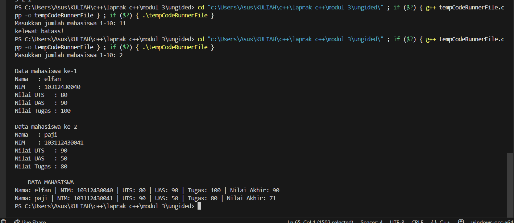

# <h1 align="center">Laporan Praktikum Modul 1 <br>  CODE BLOCKS IDE & PENGENALAN BAHASA C++</h1>
<p align="center">elfan endriyanto - 103112430040</p>

## Dasar Teori

Bahasa pemrograman C++ adalah salah satu bahasa tingkat tinggi yang banyak dimanfaatkan baik di lingkungan pendidikan maupun industri. Pada umumnya, susunan program C++ diawali dengan header file seperti #include, yang berfungsi untuk mendukung proses input dan output standar. Menurut pendapat Indahyati dan Rahmawati (2020), C++ menjadi dasar penting dalam memahami konsep algoritma serta pemrograman, terutama karena struktur sintaksnya relatif sederhana dan mudah dipahami oleh pemula.


## Guided

### soal 1

aku mengerjakan perulangan

## Unguided

### Soal 1

```go
#include <iostream>
using namespace std;

struct Mahasiswa {
    string nama;
    string nim;
    float uts;
    float uas;
    float tugas;
    float nilaiAkhir;
};

float hitungNilaiAkhir(float uts, float uas, float tugas) {
    return (0.3 * uts) + (0.4 * uas) + (0.3 * tugas);
}

void inputMahasiswa(Mahasiswa& mhs) {
    cout << "Nama   : ";
    cin >> mhs.nama;
    cout << "NIM    : ";
    cin >> mhs.nim;
    cout << "Nilai UTS   : ";
    cin >> mhs.uts;
    cout << "Nilai UAS   : ";
    cin >> mhs.uas;
    cout << "Nilai Tugas : ";
    cin >> mhs.tugas;

    mhs.nilaiAkhir = hitungNilaiAkhir(mhs.uts, mhs.uas, mhs.tugas);
}

void tampilMahasiswa(Mahasiswa mhs[], int n) {
    cout << "\n=== DATA MAHASISWA ===\n";
    for (int i = 0; i < n; i++) {
        cout << "Nama: " << mhs[i].nama;
        cout << " | NIM: " << mhs[i].nim;
        cout << " | UTS: " << mhs[i].uts;
        cout << " | UAS: " << mhs[i].uas;
        cout << " | Tugas: " << mhs[i].tugas;
        cout << " | Nilai Akhir: " << mhs[i].nilaiAkhir << endl;
    }
}

int main() {
    Mahasiswa daftarMhs[10];
    int n;

    cout << "Masukkan jumlah mahasiswa 1-10: ";
    cin >> n;

    if (n > 10) {
        cout << "kelewat batass!" << endl;
        return 0;
    }

    for (int i = 0; i < n; i++) {
        cout << "\nData mahasiswa ke-" << i + 1 << endl;
        inputMahasiswa(daftarMhs[i]);
    }

    tampilMahasiswa(daftarMhs, n);

    return 0;
}


```

> Output
> 

Program ini digunakan untuk menyimpan dan menampilkan data maksimal 10 mahasiswa. Setiap mahasiswa punya data berupa nama, NIM, nilai UTS, UAS, tugas, dan nilai akhir. Nilai akhir dihitung otomatis lewat fungsi `hitungNilaiAkhir()` dengan rumus 0.3*UTS + 0.4*UAS + 0.3*Tugas. Program meminta pengguna untuk memasukkan jumlah mahasiswa, lalu mengisi data masing-masing mahasiswa satu per satu menggunakan fungsi `inputMahasiswa()`. Setelah semua data dimasukkan, program menampilkan hasilnya lewat fungsi `tampilMahasiswa()`, yang memperlihatkan seluruh data mahasiswa beserta nilai akhirnya.

### Soal 2.1.pelajaran.h

```go
#ifndef PELAJARAN_H
#define PELAJARAN_H
#include <string>
using namespace std;

struct pelajaran {
    string namaMapel;
    string kodeMapel;
};

pelajaran create_pelajaran(string namaPel, string kodePel);
void tampil_pelajaran(pelajaran pel);

#endif


```
penjelasan kode

File **pelajaran.h** ini dipakai untuk bikin tipe data baru bernama `pelajaran` yang isinya ada nama mata pelajaran dan kode mata pelajaran. Di dalamnya juga ada dua fungsi, yaitu `create_pelajaran` buat ngisi data pelajaran baru, dan `tampil_pelajaran` buat nunjukin isi datanya. Bagian atas yang ada `#ifndef`, `#define`, dan `#endif` itu biar file ini nggak kebaca dua kali waktu dipanggil di program utama.

### Soal 2.2.pelajaran.cpp

```go
#include <iostream>
#include "pelajaran.h"
using namespace std;

pelajaran create_pelajaran(string namaPel, string kodePel) {
    pelajaran p;
    p.namaMapel = namaPel;
    p.kodeMapel = kodePel;
    return p;
}

void tampil_pelajaran(pelajaran pel) {
    cout << "nama pelajaran : " << pel.namaMapel << endl;
    cout << "nilai : " << pel.kodeMapel << endl;
}

```
Kode di atas berisi isi dari file **pelajaran.cpp**, yaitu implementasi dari fungsi yang sudah dideklarasikan di pelajaran.h. Fungsi `create_pelajaran` digunakan untuk membuat data pelajaran baru dengan mengisi nama pelajaran dan kodenya, lalu mengembalikannya dalam bentuk struct pelajaran. Sedangkan fungsi `tampil_pelajaran` digunakan untuk menampilkan data pelajaran tersebut ke layar, yaitu nama pelajaran dan kode atau nilainya. Jadi intinya, file ini berfungsi untuk menjalankan logika dari ADT pelajaran yang sudah dibuat di file header.

# Soal 2.3.main.cpp

```go
#include <iostream>
#include "pelajaran.h"
using namespace std;

int main() {
    string namaPel = "Struktur Data";
    string kodePel = "STD";

    pelajaran pel = create_pelajaran(namaPel, kodePel);
    tampil_pelajaran(pel);

    return 0;
}

```

> Output
> 

Kode di atas adalah isi dari file main.cpp, yang berfungsi untuk mencoba atau menguji ADT pelajaran yang sudah dibuat. Di dalamnya, dibuat dua variabel string yaitu namaPel berisi “Struktur Data” dan kodePel berisi “STD”. Lalu, program memanggil fungsi create_pelajaran untuk membuat objek pel berdasarkan dua data tersebut, dan hasilnya ditampilkan ke layar dengan memanggil fungsi tampil_pelajaran. Jadi intinya, program ini menampilkan informasi pelajaran dengan nama “Struktur Data” dan kode “STD” menggunakan fungsi dari ADT yang telah dibuat sebelumnya.

# Soal 3

```go
#include <iostream>
using namespace std;

struct Matrix {
    int data[3][3];
};

void tampil(Matrix M) {
    for (int i = 0; i < 3; i++) {
        for (int j = 0; j < 3; j++) {
            cout << M.data[i][j] << " ";
        }
        cout << endl;
    }
}

void tukar_posisi(Matrix &A, Matrix &B, int baris, int kolom) {
    int temp = A.data[baris][kolom];
    A.data[baris][kolom] = B.data[baris][kolom];
    B.data[baris][kolom] = temp;
}

int main() {
    Matrix A = {{{1,2,3},{4,5,6},{7,8,9}}};
    Matrix B = {{{9,8,7},{6,5,4},{3,2,1}}};

    cout << "Matrix A sebelum ditukar:\n";
    tampil(A);
    cout << "\nMatrix B sebelum ditukar:\n";
    tampil(B);

    int baris = 0, kolom = 2;
    cout << "\nMenukar elemen di posisi [" << baris << "][" << kolom << "]...\n\n";

    tukar_posisi(A, B, baris, kolom);

    cout << "Matrix A setelah ditukar:\n";
    tampil(A);
    cout << "\nMatrix B setelah ditukar:\n";
    tampil(B);

    return 0;
}


```

> Output
> 

Program di atas membuat dan menampilkan dua buah **matriks (A dan B)** berukuran 3x3, lalu menukar salah satu elemen di posisi tertentu antara kedua matriks. Struktur `Matrix` digunakan untuk menyimpan data dalam bentuk array 3x3, sesuai konsep **ADT (Abstract Data Type)** agar data matriks lebih terorganisir. Fungsi `tampil` menampilkan isi matriks ke layar, sedangkan fungsi `tukar_posisi` menukar elemen pada baris dan kolom tertentu antara matriks A dan B. Dalam program utama, elemen di posisi `[0][2]` (baris pertama kolom ketiga) ditukar, kemudian hasil perubahan kedua matriks ditampilkan kembali ke layar.

## Referensi

1. https://en.wikipedia.org/wiki/Data_structure (diakses blablabla)
