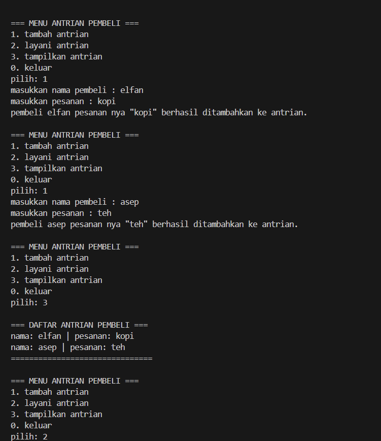
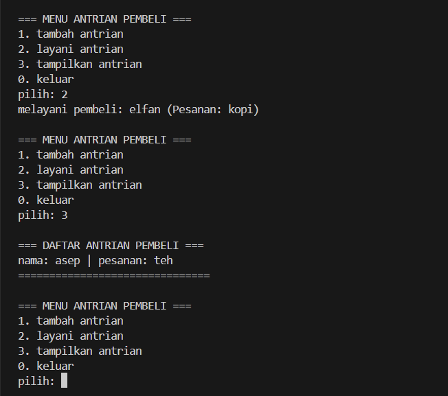
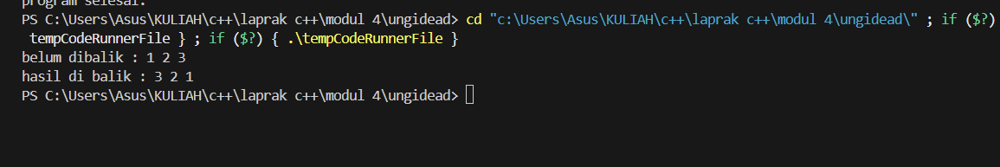

# <h1 align="center">Laporan Praktikum Modul 1 <br>  CODE BLOCKS IDE & PENGENALAN BAHASA C++</h1>
<p align="center">elfan endriyanto - 103112430040</p>

## Dasar Teori

Bahasa pemrograman C++ adalah salah satu bahasa tingkat tinggi yang banyak dimanfaatkan baik di lingkungan pendidikan maupun industri. Pada umumnya, susunan program C++ diawali dengan header file seperti #include, yang berfungsi untuk mendukung proses input dan output standar. Menurut pendapat Indahyati dan Rahmawati (2020), C++ menjadi dasar penting dalam memahami konsep algoritma serta pemrograman, terutama karena struktur sintaksnya relatif sederhana dan mudah dipahami oleh pemula.


## Guided

### soal 1

aku mengerjakan perulangan

## Unguided

### Soal 1

```go
#include <iostream>
using namespace std;

struct Node {
    string nama;
    string pesanan;
    Node* next;
};

Node* head = nullptr;

Node* createnode(string nama, string pesanan) {
    Node* newNode = new Node();
    newNode->nama = nama;
    newNode->pesanan = pesanan;
    newNode->next = nullptr;
    return newNode;
}

void tambahantrian(string nama, string pesanan) {
    Node* newNode = createnode(nama, pesanan);
    if (head == nullptr) {
        head = newNode;
    } else {
        Node* temp = head;
        while (temp->next != nullptr) {
            temp = temp->next;
        }
        temp->next = newNode;
    }
    cout << "pembeli " << nama << " pesanan nya \"" << pesanan << "\" berhasil ditambahkan ke antrian.\n";
}

void layaniantrian() {
    if (head == nullptr) {
        cout << "tidak ada antrian! tidak ada yang bisa di layani.\n";
        return;
    }

    Node* temp = head;
    cout << "melayani pembeli: " << temp->nama << " (Pesanan: " << temp->pesanan << ")\n";
    head = head->next;
    delete temp;
}

void tampilkanantrian() {
    if (head == nullptr) {
        cout << "tidak ada antrian!!\n";
        return;
    }

    Node* temp = head;
    cout << "\n=== DAFTAR ANTRIAN PEMBELI ===\n";
    while (temp != nullptr) {
        cout << "nama: " << temp->nama << " | pesanan: " << temp->pesanan << endl;
        temp = temp->next;
    }
    cout << "===============================\n";
}

int main() {
    int pilihan;
    string nama, pesanan;

    do {
        cout << "\n=== MENU ANTRIAN PEMBELI ===\n";
        cout << "1. tambah antrian\n";
        cout << "2. layani antrian\n";
        cout << "3. tampilkan antrian\n";
        cout << "0. keluar\n";
        cout << "pilih: ";
        cin >> pilihan;

        switch (pilihan) {
            case 1:
                cout << "masukkan nama pembeli : ";
                cin >> nama;
                cout << "masukkan pesanan : ";
                cin >> pesanan;
                tambahantrian(nama, pesanan);
                break;
            case 2:
                layaniantrian();
                break;
            case 3:
                tampilkanantrian();
                break;
            case 0:
                cout << "program selesai.\n";
                break;
            default:
                cout << "pilihan tidak valid!\n";
        }
    } while (pilihan != 0);

    return 0;
}


```

> Output
> 

> Output
> 

Pada soal Unguided 1, program yang dibuat tergolong mudah. Saya diminta mendeklarasikan dua buah variabel dengan tipe data float untuk menampung nilai masukan dari pengguna. Nilai tersebut kemudian diproses menggunakan operasi aritmatika dasar. Selain itu, saya menambahkan aturan sederhana berupa pengecekan pada bagian pembagian, karena tidak mungkin sebuah bilangan dibagi dengan nol.

### Soal 2

```go
#include <iostream>
using namespace std;

struct Node {
    int data;
    Node* next;
};

Node* head = nullptr;

Node* createNode(int data) {
    Node* newNode = new Node();
    newNode->data = data;
    newNode->next = nullptr;
    return newNode;
}

void insertBelakang(int data) {
    Node* newNode = createNode(data);
    if (head == nullptr) {
        head = newNode;
    } else {
        Node* temp = head;
        while (temp->next != nullptr) {
            temp = temp->next;
        }
        temp->next = newNode;
    }
}

void tampilkanList() {
    Node* temp = head;
    while (temp != nullptr) {
        cout << temp->data << " ";
        temp = temp->next;
    }
    cout << endl;
}

void membaliklist() {
    Node* prev = nullptr;
    Node* temp = head;
    Node* next = nullptr;

    while (temp != nullptr) {
        next = temp->next;
        temp->next = prev;
        prev = temp;
        temp = next;
    }
    head = prev;
}

int main() {
    insertBelakang(1);
    insertBelakang(2);
    insertBelakang(3);

    cout << "belum dibalik : ";
    tampilkanList();

    membaliklist();

    cout << "hasil di balik : ";
    tampilkanList();

    return 0;
}


```

> Output
> 

penjelasan kode

Program pada soal Unguided 2 terasa lebih menantang dibanding sebelumnya. Di dalam program, saya membuat sebuah fungsi bernama sebutAngka(int n) yang bertugas memproses angka sesuai dengan aturan tertentu. Apabila input bernilai 0, maka fungsi akan mengembalikan kata “nol”, sedangkan jika bernilai 100 hasilnya adalah “seratus”. Untuk angka kurang dari 10, program langsung mengambil kata yang sesuai dari array satuan. Khusus untuk rentang 10–19, digunakan aturan khusus, misalnya 10 menjadi “sepuluh”, 11 menjadi “sebelas”, sementara 12 hingga 19 akan dikonversi menjadi bentuk [satuan] belas. Sementara itu, angka 20 sampai 99 dibentuk dengan menuliskan nilai puluhannya, seperti “dua puluh” atau “tiga puluh”, lalu ditambahkan kata satuan jika angkanya tidak genap puluhan.


## Referensi

1. https://en.wikipedia.org/wiki/Data_structure (diakses blablabla)
