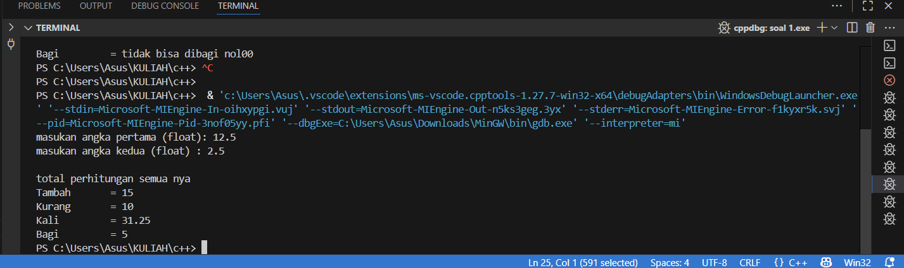
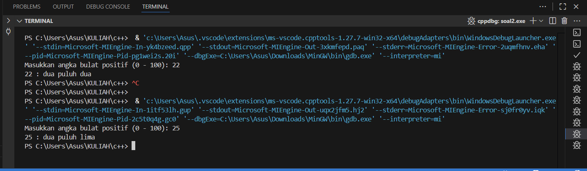
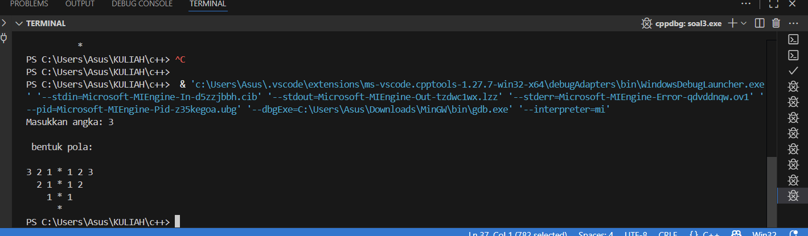

# <h1 align="center">Laporan Praktikum Modul 1 <br>  CODE BLOCKS IDE & PENGENALAN BAHASA C++</h1>
<p align="center">elfan endriyanto - 103112430040</p>

## Dasar Teori

C++ adalah bahasa pemrograman tingkat tinggi yang dikembangkan oleh Bjarne Stroustrup pada awal 1980-an di Bell Labs. Dirancang sebagai versi yang lebih lengkap dari bahasa pemrograman C, ada banyak fitur tambahan yang disertakan oleh C++.

Fitur ini termasuk object-oriented programming (OOP), pengelolaan memori secara manual, dan penggunaan template generik. Hasilnya, bahasa pemrograman ini pun menjadi lebih fleksibel dan efisien untuk berbagai kebutuhan.

C++ juga dirancang untuk menangani proyek pemrograman kompleks, termasuk aplikasi dengan performa tinggi seperti sistem operasi dan software grafis. Selain itu, C++ mendukung berbagai gaya pemrograman, mulai dari prosedural, generik, hingga berorientasi objek sehingga cocok untuk pengembangan software skala besar.

Berikut merupakan konsep dasar dalam bahasa C++

### 1. **Variabel**

Variabel adalah tempat penyimpanan data dalam program, yang memiliki nama dan nilai tertentu. Di C++, variabel memiliki tipe data yang menentukan jenis nilai yang bisa disimpan.

Berikut adalah tipe-tipe data yang ada dalam variabel C++:

- bool: singkatan dari tipe data boolean, yang hanya berisi dua nilai, yaitu True atau False.
- char: kependekan dari character, yaitu tipe data huruf dari A sampai Z.
- int: kepanjangannya adalah integer, yaitu tipe berupa angka.
- float dan double: tipe data yang berupa angka pecahan, contohnya 1,33.
- string: tipe data dalam bentuk kumpulan karakter, seperti “bahasa pemrograman C++“.

Selain itu, variabel bisa bersifat konstan dengan kata kunci const, yang artinya nilainya tidak bisa diubah setelah ditentukan. C++ juga mendukung pointer, yaitu variabel yang menyimpan alamat memori sehingga developer bisa mengontrol memori secar langsung.

Penulisan variabel dalam C++ terdiri dari dua langkah, yaitu deklarasi dan inisialisasi.

### 2. **Syntax**

Sintaks merupakan pedoman dan peraturan yang harus diikuti ketika menuliskan baris kode/instruksi dalam bahasa pemrograman. Selain itu, sintaks juga dapat dipandang sebagai kerangka yang menentukan struktur bahasa pemrograman.

Bahasa C++ juga memiliki sintaks untuk fungsi-fungsi yang sudah disediakan. Instruksi yang berbeda memiliki sintaks yang berbeda yang menentukan penggunaannya, tetapi program C++ juga memiliki aturan sintaks dasar yang diikuti di seluruh program.

- #include <iostream> : bagian ini disebut preprocessor directive untuk menyertakan file header.

- <iostream> : memberikan akses ke fungsi input-output standar dalam C++.

- using namespace std : bagian ini disebut deklarasi yang memberi tahu program untuk menggunakan namespace std yang berisi banyak fungsi dan objek standar.

- int main() : bagian ini disebut deklarasi fungsi utama (main) yang merupakan pintu masuk eksekusi untuk program C++.

- { dan } : bagian ini disebut kurung kurawal membuka dan menutup blok baris kode untuk fungsi main.

- Semicolon ( ; ) : setiap baris kode dalam contoh di atas diakhiri dengan simbol titik koma ( ; ). Simbol ini berfungsi sebagai penanda akhir dari setiap baris kode dalam program. Ketika kompiler menemui titik koma ini, proses eksekusi pada baris tersebut dihentikan dan lanjut ke baris kode berikutnya.

- return 0; : bagian ini disebut pernyataan kembalian yang mengindikasikan bahwa program telah selesai dengan sukses, sedangkan 0 adalah kode keluaran yang menunjukkan tidak ada kesalahan.

### 3. **Komentar**

Komentar dalam bahasa pemrograman C++ bertujuan untuk memberikan penjelasan mengenai setiap baris kode dengan tujuan memudahkan pembacaan. Penulisan komentar ini dilakukan untuk menyediakan informasi yang relevan terkait dengan implementasi kode yang sedang dibuat. Praktik ini umum dilakukan oleh para programmer sebagai bagian dari dokumentasi proyek mereka.

### 4. **Operasi Aritmatika**

Aritmatika adalah cabang ilmu matematika yang membahas perhitungan dasar "kabataku", yakni operasi perkalian, pembagian, penambahan dan pengurangan.

Selain keempat operasi di atas, bahasa C++ juga memiliki operasi modulo division, atau operator % yang dipakai untuk mencari sisa hasil bagi.

Berikut merupakan operasi aritmatika yang dapat dilakukan dalam bahasa C++.

- +=: assignment penambahan (Contoh: A += 7 ekuivalen dengan A = A + 7).
- -= : assignment pengurangan.
- \*= : assignment perkalian.
- /= : assignment pembagian.
- %=: assignment mod.

### 5. **Control Structures**

Control structure mengatur alur eksekusi program berdasarkan kondisi tertentu. Ada beberapa control structure utama dalam C++, termasuk if-else untuk percabangan serta for, while, dan do-while untuk loop atau perulangan.

Dengan struktur ini, program bisa memberikan respons yang berbeda tergantung pada input atau kondisi yang terjadi selama runtime. Control structure memastikan efisiensi dalam pemrosesan, terutama saat menangani data besar atau algoritma yang kompleks.

**if**<br>
Statement `if` digunakan untuk mengevaluasi ekspresi logis yang menghasilkan nilai `true` atau `false`. Apabila nilainya `true`, blok kode di dalam `if` akan dieksekusi. Kalau tidak, blok tersebut akan dilewati.

**else if dan else**<br>
Apabila kondisi di dalam `if` bernilai `false`, Anda bisa menggunakan `else if` untuk memeriksa kondisi lainnya. Kalau semua kondisi `if` dan `else if` bernilai `false`, blok `else` akan dijalankan sebagai opsi terakhir.

**for**<br>
Loop `for` digunakan untuk melakukan pengulangan dengan jumlah yang diketahui. Struktur ini mencakup **inisialisasi**, **kondisi**, dan **inkrementasi/dekrementasi** dalam satu baris.

Contohnya adalah sebagai berikut:

```c++
...
int main() {
for (int i = 0; i < 5; i++) {
    cout << "Perulangan ke-" << i << endl;
}
```

Pada contoh di atas, variabel `i` diinisialisasi dengan nilai 0. Loop akan berulang selama `i < 5`, dan setiap kali loop berakhir, nilai `i` akan bertambah 1. Pengulangan akan berhenti saat kondisi `i < 5` tidak lagi terpenuhi.

**while**<br>
Loop `while` akan terus mengeksekusi blok kode selama ekspresi kondisional bernilai `true`. Pengulangan akan berhenti begitu kondisi menjadi `false`.

**do-while**<br>
Dengan `do-while`, blok kode akan dieksekusi minimal satu kali, bahkan meskipun kondisinya bernilai `false` saat pemeriksaan pertama. Setelah satu kali eksekusi, kondisi akan diperiksa untuk menentukan apakah loop akan dijalankan lagi.

### 6. **Function**

Sebuah Function dalam C++ adalah blok kode yang dapat menerima input (dalam bentuk parameter) dari pemanggilnya, melakukan serangkaian operasi, dan secara opsional mengembalikan nilai sebagai output. Function sangat berguna untuk mengorganisir kode secara terstruktur dan dapat digunakan kembali.

**Deklarasi Function**<br>
Sebuah deklarasi Function minimal terdiri dari tipe pengembalian, nama Function, dan daftar parameter.

**Definisi Function**<br>
Definisi Function terdiri dari deklarasi dan body Function. Body Function adalah bagian dari Function yang berisi kode yang akan dieksekusi ketika Function dipanggil.

**Parameter dan Argumen**<br>
Sebuah Function memiliki daftar parameter yang memungkinkan pemanggil untuk meneruskan argumen ke dalam Function. Argumen adalah nilai konkret yang dilewatkan ke Function. Anda dapat menggunakan referensi atau nilai untuk mem-pass argumen ke dalam Function.

**Jenis Return**<br>
Jenis return function merujuk pada nilai yang dikembalikan oleh suatu fungsi setelah melakukan operasi atau pemrosesan tertentu. Dalam bahasa pemrograman C++, sebuah function dapat mengembalikan berbagai jenis nilai tergantung pada kebutuhan dan logika programnya.

## Guided

### soal 1 aritmatika.cpp

```go
#include <iostream>
using namespace std;
int main()
{
    int W, X, Y;
    float Z;
    X = 7;
    Y = 3;
    W = 1;
    Z = (X + Y) / (Y + W);
    cout << "Nilai z = " << Z << endl;
    return 0;
}
```

> Output
> 

penjelasan kode

PProgram ini mendeklarasikan variabel X, Y, dan W bertipe int, serta Z bertipe float. Nilai yang diberikan adalah X = 7, Y = 3, dan W = 1. Pada baris perhitungan, ekspresi (X + Y) / (Y + W) sebenarnya menghasilkan 10 / 4. Namun karena pembagian dilakukan antara dua bilangan integer, hasilnya dibulatkan ke bawah menjadi 2 terlebih dahulu, baru kemudian disimpan ke dalam variabel Z. Itulah sebabnya output yang ditampilkan adalah Nilai z = 2, bukan 2.5.

### soal 2 fungsi.cpp

```go
#include <iostream>
using namespace std;

// Prosedur: hanya menampilkan hasil, tidak mengembalikan nilai
void tampilkanHasil(double p, double l)
{
    cout << "\n=== Hasil Perhitungan ===" << endl;
    cout << "Panjang : " << p << endl;
    cout << "Lebar   : " << l << endl;
    cout << "Luas    : " << p * l << endl;
    cout << "Keliling: " << 2 * (p + l) << endl;
}

// Fungsi: mengembalikan nilai luas
double hitungLuas(double p, double l)
{
    return p * l;
}

// Fungsi: mengembalikan nilai keliling
double hitungKeliling(double p, double l)
{
    return 2 * (p + l);
}

int main()
{
    double panjang, lebar;

    cout << "Masukkan panjang: ";
    cin >> panjang;
    cout << "Masukkan lebar  : ";
    cin >> lebar;

    // Panggil fungsi
    double luas = hitungLuas(panjang, lebar);
    double keliling = hitungKeliling(panjang, lebar);

    cout << "\nDihitung dengan fungsi:" << endl;
    cout << "Luas      = " << luas << endl;
    cout << "Keliling  = " << keliling << endl;

    // Panggil prosedur
    tampilkanHasil(panjang, lebar);

    return 0;
}

```

> Output
> 


penjelasan kode

Program ini menghitung luas dan keliling persegi panjang dengan memanfaatkan fungsi dan prosedur. Nilai panjang dan lebar yang dimasukkan pengguna dihitung oleh fungsi hitungLuas dan hitungKeliling, lalu hasilnya ditampilkan. Setelah itu, prosedur tampilkanHasil menampilkan kembali panjang, lebar, luas, dan keliling tanpa mengembalikan nilai. Untuk input panjang 5 dan lebar 3, diperoleh luas 15 dan keliling 16.

### soal 3 kondisi.cpp

```go
#include <iostream>
using namespace std;

int main() {
    int kode_hari;

    cout << "Menentukan hari kerja/libur\n";
    cout << "1=Senin 2=Selasa 3=Rabu 4=Kamis 5=Jumat\n";
    cout << "6=Sabtu 7=Minggu\n";
    cout << "Masukkan kode hari: ";
    cin >> kode_hari;

    switch (kode_hari) {
        case 1: case 2: case 3: case 4: case 5:
            cout << "Hari Kerja" << endl;
            break;
        case 6: case 7:
            cout << "Hari Libur" << endl;
            break;
        default:
            cout << "Kode masukan salah!!!" << endl;
    }

    return 0;
}

```

> Output
> 


penjelasan kode

Program ini menggunakan struktur switch–case untuk menentukan apakah suatu hari termasuk hari kerja atau hari libur berdasarkan kode angka yang dimasukkan pengguna. Kode 1 sampai 5 dianggap sebagai hari kerja (Senin–Jumat), sedangkan kode 6 dan 7 sebagai hari libur (Sabtu–Minggu). Jika pengguna memasukkan angka di luar rentang tersebut, program akan menampilkan pesan bahwa kode yang dimasukkan salah. Contohnya, saat input 2 hasilnya “Hari Kerja”, input 6 menghasilkan “Hari Libur”, dan input 9 dianggap tidak valid.

### soal 4 perulangan.cpp

```go
#include <iostream>
using namespace std;

int main()
{
    int i = 1;
    int jum;
    cin >> jum;

    do
    {
        cout << "bahlil ke-" << i << endl;
        i++;
    } while (i <= jum);

    return 0;
}

```

> Output
> 


penjelasan kode

Program ini menggunakan perulangan do–while untuk menampilkan teks “bahlil ke-i” sebanyak jumlah yang dimasukkan pengguna. Nilai jum dibaca dari input sebagai batas perulangan, lalu variabel i dimulai dari 1. Karena do–while dijalankan minimal satu kali, program akan terus mencetak hingga i lebih besar dari jum. Pada contoh input 3, output yang dihasilkan adalah tiga baris dari bahlil ke-1 sampai bahlil ke-3.

### soal 5 struct.cpp

```go
#include <iostream>
#include <string>
using namespace std;

// Definisi struct
struct Mahasiswa {
    string nama;
    string nim;
    float ipk;
};

int main() {

    Mahasiswa mhs1;

    cout << "Masukkan Nama Mahasiswa: ";
    getline(cin, mhs1.nama);
    // cin >> mhs1.nama;
    cout << "Masukkan NIM Mahasiswa : ";
    cin >> mhs1.nim;
    cout << "Masukkan IPK Mahasiswa : ";
    cin >> mhs1.ipk;

    cout << "\n=== Data Mahasiswa ===" << endl;
    cout << "Nama : " << mhs1.nama << endl;
    cout << "NIM  : " << mhs1.nim << endl;
    cout << "IPK  : " << mhs1.ipk << endl;

    return 0;
}

```

> Output
> 


penjelasan kode

Program ini digunakan untuk memasukkan dan menampilkan data seorang mahasiswa dengan menggunakan struct bernama Mahasiswa yang berisi nama, NIM, dan IPK. Program meminta pengguna mengetikkan nama menggunakan getline agar spasi dapat terbaca, lalu membaca NIM dan IPK dengan cin. Setelah semua data dimasukkan, program menampilkan kembali informasi tersebut pada bagian “=== Data Mahasiswa ===” sesuai nilai yang telah diberikan pengguna.

## Unguided

### Soal 1

```go
#include <iostream>
using namespace std;

int main() {
    float x, y;

    cout << "masukan angka pertama (float): ";
    cin >> x;
    cout << "masukan angka kedua (float) : ";
    cin >> y;

    cout << "\n total perhitungan semua nya" << endl;
    cout << "Tambah       = " << x + y << endl;
    cout << "Kurang       = " << x - y << endl;
    cout << "Kali         = " << x * y << endl;

    if (y == 0) {
        cout << "Bagi         = tidak bisa dibagi nol00" << endl;
    } else {
        cout << "Bagi         = " << (x / y) << endl;
    }

    return 0;
}

```

> Output
> 

Pada soal Unguided 1, program yang dibuat tergolong mudah. Saya diminta mendeklarasikan dua buah variabel dengan tipe data float untuk menampung nilai masukan dari pengguna. Nilai tersebut kemudian diproses menggunakan operasi aritmatika dasar. Selain itu, saya menambahkan aturan sederhana berupa pengecekan pada bagian pembagian, karena tidak mungkin sebuah bilangan dibagi dengan nol.

### Soal 2

```go
#include <iostream>
#include <string>
using namespace std;

string sebutangka(int n) {
    string angkadasar[] = {"nol", "satu", "dua", "tiga", "empat",
                           "lima", "enam", "tujuh", "delapan", "sembilan"};

    if (n == 0) return "nol";
    if (n == 100) return "seratus";

    if (n < 10) {
        return angkadasar[n];
    } 
    else if (n < 20) {
        if (n == 10) return "sepuluh";
        if (n == 11) return "sebelas";
        return angkadasar[n % 10] + " belas";
    } 
    else {
        string hasil = angkadasar[n / 10] + " puluh";
        if (n % 10 != 0) {
            hasil += " " + angkadasar[n % 10];
        }
        return hasil;
    }
}

int main() {
    int angka;
    cout << "Masukkan angka bulat positif (0 - 100): ";
    cin >> angka;

   cout << angka << " : " << sebutangka(angka) << endl;

    return 0;
}

```

> Output
> 

penjelasan kode

Program pada soal Unguided 2 terasa lebih menantang dibanding sebelumnya. Di dalam program, saya membuat sebuah fungsi bernama sebutAngka(int n) yang bertugas memproses angka sesuai dengan aturan tertentu. Apabila input bernilai 0, maka fungsi akan mengembalikan kata “nol”, sedangkan jika bernilai 100 hasilnya adalah “seratus”. Untuk angka kurang dari 10, program langsung mengambil kata yang sesuai dari array satuan. Khusus untuk rentang 10–19, digunakan aturan khusus, misalnya 10 menjadi “sepuluh”, 11 menjadi “sebelas”, sementara 12 hingga 19 akan dikonversi menjadi bentuk [satuan] belas. Sementara itu, angka 20 sampai 99 dibentuk dengan menuliskan nilai puluhannya, seperti “dua puluh” atau “tiga puluh”, lalu ditambahkan kata satuan jika angkanya tidak genap puluhan.

### Soal 3

```go
#include <iostream>
using namespace std;

void Mirror(int n) {
    for (int baris = n; baris >= 1; baris--) {
        for (int jarak = 0; jarak < n - baris; jarak++) {
            cout << "  ";
        }
        for (int kiri = baris; kiri >= 1; kiri--) {
            cout << kiri << " ";
        }
        cout << "*";
        for (int kanan = 1; kanan <= baris; kanan++) {
            cout << " " << kanan;
        }
        cout << endl;
    }

     if (n >= 1) {
        for (int jarak = 0; jarak < n; jarak++) {
            cout << "  ";
        }
         cout << "* " << endl;
    }
}

int main() {
    int jumlah;
    cout << "Masukkan angka: ";
    cin >> jumlah;

    cout << "\n bentuk pola:\n\n";
    Mirror(jumlah);

    return 0;
}

```

> Output
> 

Pada soal Unguided 3, tingkat kesulitannya relatif mudah karena saya sudah pernah melakukan praktik serupa sebelumnya, meskipun terdapat sedikit perbedaan pada implementasi. Secara garis besar algoritmanya tidak jauh berbeda, namun dari latihan ini saya mendapatkan pemahaman baru terkait perbedaan penggunaan pre-increment/decrement dan post-increment/decrement. Alur kerjanya bisa dijelaskan sebagai berikut: for loop pertama mengatur jumlah baris yang dicetak dari atas ke bawah, for loop kedua digunakan untuk mencetak spasi agar pola tampak bergeser ke kanan, for loop ketiga menghasilkan deret angka menurun dari nilai tertentu hingga 1, sedangkan for loop keempat mencetak deret angka menaik dari 1 kembali ke nilai semula setelah tanda bintang. Selain itu, terdapat tambahan for loop di dalam blok if yang berfungsi untuk menampilkan spasi terakhir pada baris paling bawah, kemudian mencetak satu bintang sebagai penutup sehingga bentuk cerminnya menjadi utuh.


## Referensi

1. _Hostinger_. https://www.hostinger.com/id/tutorial/bahasa-pemrograman-cpp. Diakses pada 03 Oktober 2025.
2. _Dicoding_. https://www.dicoding.com/blog/memahami-esensi-bahasa-pemrograman-c/. Diakses pada 03 Oktober 2025.
3. _Duniailkom_. https://www.duniailkom.com/tutorial-belajar-c-plus-plus-jenis-jenis-operator-aritmatika-bahasa-c-plus-plus/. Diakses pada 03 Oktober 2025.
4. _kodingakademi_. https://www.kodingakademi.id/function-c-panduan-lengkap/. Diakses pada 03 Oktober 2025.
