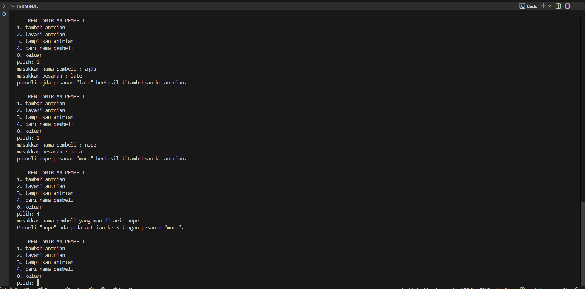
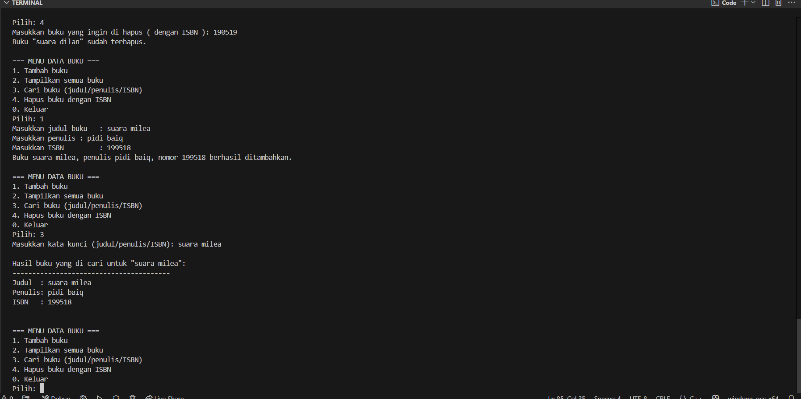

# <h1 align="center">Laporan Praktikum Modul 5 <br> SINGLY LINKED LIST (BAGIAN KEDUA)</h1>
<p align="center">elfan endriyanto - 103112430040</p>
## Dasar Teori

C++ adalah bahasa pemrograman tingkat tinggi yang dikembangkan oleh Bjarne Stroustrup pada awal 1980-an di Bell Labs. Dirancang sebagai versi yang lebih lengkap dari bahasa pemrograman C, ada banyak fitur tambahan yang disertakan oleh C++.

Fitur ini termasuk object-oriented programming (OOP), pengelolaan memori secara manual, dan penggunaan template generik. Hasilnya, bahasa pemrograman ini pun menjadi lebih fleksibel dan efisien untuk berbagai kebutuhan.

C++ juga dirancang untuk menangani proyek pemrograman kompleks, termasuk aplikasi dengan performa tinggi seperti sistem operasi dan software grafis. Selain itu, C++ mendukung berbagai gaya pemrograman, mulai dari prosedural, generik, hingga berorientasi objek sehingga cocok untuk pengembangan software skala besar.

Berikut merupakan konsep dasar dalam bahasa C++

### 1. **Variabel**

Variabel adalah tempat penyimpanan data dalam program, yang memiliki nama dan nilai tertentu. Di C++, variabel memiliki tipe data yang menentukan jenis nilai yang bisa disimpan.

Berikut adalah tipe-tipe data yang ada dalam variabel C++:

- bool: singkatan dari tipe data boolean, yang hanya berisi dua nilai, yaitu True atau False.
- char: kependekan dari character, yaitu tipe data huruf dari A sampai Z.
- int: kepanjangannya adalah integer, yaitu tipe berupa angka.
- float dan double: tipe data yang berupa angka pecahan, contohnya 1,33.
- string: tipe data dalam bentuk kumpulan karakter, seperti “bahasa pemrograman C++“.

Selain itu, variabel bisa bersifat konstan dengan kata kunci const, yang artinya nilainya tidak bisa diubah setelah ditentukan. C++ juga mendukung pointer, yaitu variabel yang menyimpan alamat memori sehingga developer bisa mengontrol memori secar langsung.

Penulisan variabel dalam C++ terdiri dari dua langkah, yaitu deklarasi dan inisialisasi.

### 2. **Syntax**

Sintaks merupakan pedoman dan peraturan yang harus diikuti ketika menuliskan baris kode/instruksi dalam bahasa pemrograman. Selain itu, sintaks juga dapat dipandang sebagai kerangka yang menentukan struktur bahasa pemrograman.

Bahasa C++ juga memiliki sintaks untuk fungsi-fungsi yang sudah disediakan. Instruksi yang berbeda memiliki sintaks yang berbeda yang menentukan penggunaannya, tetapi program C++ juga memiliki aturan sintaks dasar yang diikuti di seluruh program.

- #include <iostream> : bagian ini disebut preprocessor directive untuk menyertakan file header.

- <iostream> : memberikan akses ke fungsi input-output standar dalam C++.

- using namespace std : bagian ini disebut deklarasi yang memberi tahu program untuk menggunakan namespace std yang berisi banyak fungsi dan objek standar.

- int main() : bagian ini disebut deklarasi fungsi utama (main) yang merupakan pintu masuk eksekusi untuk program C++.

- { dan } : bagian ini disebut kurung kurawal membuka dan menutup blok baris kode untuk fungsi main.

- Semicolon ( ; ) : setiap baris kode dalam contoh di atas diakhiri dengan simbol titik koma ( ; ). Simbol ini berfungsi sebagai penanda akhir dari setiap baris kode dalam program. Ketika kompiler menemui titik koma ini, proses eksekusi pada baris tersebut dihentikan dan lanjut ke baris kode berikutnya.

- return 0; : bagian ini disebut pernyataan kembalian yang mengindikasikan bahwa program telah selesai dengan sukses, sedangkan 0 adalah kode keluaran yang menunjukkan tidak ada kesalahan.

### 3. **Komentar**

Komentar dalam bahasa pemrograman C++ bertujuan untuk memberikan penjelasan mengenai setiap baris kode dengan tujuan memudahkan pembacaan. Penulisan komentar ini dilakukan untuk menyediakan informasi yang relevan terkait dengan implementasi kode yang sedang dibuat. Praktik ini umum dilakukan oleh para programmer sebagai bagian dari dokumentasi proyek mereka.

### 4. **Operasi Aritmatika**

Aritmatika adalah cabang ilmu matematika yang membahas perhitungan dasar "kabataku", yakni operasi perkalian, pembagian, penambahan dan pengurangan.

Selain keempat operasi di atas, bahasa C++ juga memiliki operasi modulo division, atau operator % yang dipakai untuk mencari sisa hasil bagi.

Berikut merupakan operasi aritmatika yang dapat dilakukan dalam bahasa C++.

- +=: assignment penambahan (Contoh: A += 7 ekuivalen dengan A = A + 7).
- -= : assignment pengurangan.
- \*= : assignment perkalian.
- /= : assignment pembagian.
- %=: assignment mod.

### 5. **Control Structures**

Control structure mengatur alur eksekusi program berdasarkan kondisi tertentu. Ada beberapa control structure utama dalam C++, termasuk if-else untuk percabangan serta for, while, dan do-while untuk loop atau perulangan.

Dengan struktur ini, program bisa memberikan respons yang berbeda tergantung pada input atau kondisi yang terjadi selama runtime. Control structure memastikan efisiensi dalam pemrosesan, terutama saat menangani data besar atau algoritma yang kompleks.

**if**<br>
Statement `if` digunakan untuk mengevaluasi ekspresi logis yang menghasilkan nilai `true` atau `false`. Apabila nilainya `true`, blok kode di dalam `if` akan dieksekusi. Kalau tidak, blok tersebut akan dilewati.

**else if dan else**<br>
Apabila kondisi di dalam `if` bernilai `false`, Anda bisa menggunakan `else if` untuk memeriksa kondisi lainnya. Kalau semua kondisi `if` dan `else if` bernilai `false`, blok `else` akan dijalankan sebagai opsi terakhir.

**for**<br>
Loop `for` digunakan untuk melakukan pengulangan dengan jumlah yang diketahui. Struktur ini mencakup **inisialisasi**, **kondisi**, dan **inkrementasi/dekrementasi** dalam satu baris.

Contohnya adalah sebagai berikut:

```c++
...
int main() {
for (int i = 0; i < 5; i++) {
    cout << "Perulangan ke-" << i << endl;
}
```

Pada contoh di atas, variabel `i` diinisialisasi dengan nilai 0. Loop akan berulang selama `i < 5`, dan setiap kali loop berakhir, nilai `i` akan bertambah 1. Pengulangan akan berhenti saat kondisi `i < 5` tidak lagi terpenuhi.

**while**<br>
Loop `while` akan terus mengeksekusi blok kode selama ekspresi kondisional bernilai `true`. Pengulangan akan berhenti begitu kondisi menjadi `false`.

**do-while**<br>
Dengan `do-while`, blok kode akan dieksekusi minimal satu kali, bahkan meskipun kondisinya bernilai `false` saat pemeriksaan pertama. Setelah satu kali eksekusi, kondisi akan diperiksa untuk menentukan apakah loop akan dijalankan lagi.

### 6. **Function**

Sebuah Function dalam C++ adalah blok kode yang dapat menerima input (dalam bentuk parameter) dari pemanggilnya, melakukan serangkaian operasi, dan secara opsional mengembalikan nilai sebagai output. Function sangat berguna untuk mengorganisir kode secara terstruktur dan dapat digunakan kembali.

**Deklarasi Function**<br>
Sebuah deklarasi Function minimal terdiri dari tipe pengembalian, nama Function, dan daftar parameter.

**Definisi Function**<br>
Definisi Function terdiri dari deklarasi dan body Function. Body Function adalah bagian dari Function yang berisi kode yang akan dieksekusi ketika Function dipanggil.

**Parameter dan Argumen**<br>
Sebuah Function memiliki daftar parameter yang memungkinkan pemanggil untuk meneruskan argumen ke dalam Function. Argumen adalah nilai konkret yang dilewatkan ke Function. Anda dapat menggunakan referensi atau nilai untuk mem-pass argumen ke dalam Function.

**Jenis Return**<br>
Jenis return function merujuk pada nilai yang dikembalikan oleh suatu fungsi setelah melakukan operasi atau pemrosesan tertentu. Dalam bahasa pemrograman C++, sebuah function dapat mengembalikan berbagai jenis nilai tergantung pada kebutuhan dan logika programnya.

### 7. **Array**

Array merupakan struktur data yang digunakan untuk `menyimpan sekumpulan data` dalam satu tempat. Setiap data dalam Array memiliki indeks, sehingga kita akan mudah memprosesnya.

Indeks array selalu dimulai dari angka nol (`0`). Pada teori struktur data ukuran array akan bergantung dari banyaknya data yang disimpan di dalamnya.

**Cara Membuat Array pada C++**<br>
Pada C++, array dapat kita buat dengan cara seperti ini.

```c++
// membuat array kosong dengan tipe data integer dan panjang 10
int nama_array[10];

// membuat array dengan langsung diisi
int nama_arr[3] = {0, 3, 2}
```

Cara membuat array hampir sama seperti cara membuat variabel biasa. Bedanya pada array kita harus menentukan panjangnya.

**Cara Mengambil Data dari Array**<br>
Seperti yang sudah kita ketahui, array akan menyimpan sekumpulan data dan memberinya nomer indeks agar mudah diakses. Indeks array selalu dimulai dari nol `0`.

Misalkan kita punya array seperti ini: <br>
`char huruf[5] = {'a', 'b', 'c', 'd', 'e'};`<br>
Bagaimana cara mengambil huruf `c`?

Jawabannya:
`huruf[2];`

**Mengisi Ulang Data Array**<br>
Data pada array dapat kita isi ulang dengan cara seperti ini:<br>
`huruf[2] = 'z';`<br>
Maka isi array `huruf` pada indeks ke-2 akan bernilai z`.

### 8. **Linked List**

Dalam C++, linked list merupakan struktur data linear yang memungkinkan user untuk menyimpan data di lokasi memory yang tidak berurutan. Sebuah linked list didefinisikan sebagai sekumpulan nodes yang dimana tiap node memiliki 2 anggota: value node itu sendiri dan petunjuk next/previous yang menyimpan alamat node berikutnya/sebelumnya.

**Representasi Linked List dalam C++**<br>
Dalam C++, linked list pada dasarnya direpresentasikan oleh pointer ke node pertama, yang umumnya disebut sebagai "**head**" dari list tersebut. Setiam node dalam list didefinisikan oleh struktur yang mencakup data field dan pointer yang mengarah ke struktur dengan tipe yang sama. Jenis struktur ini dikenal sebagai struktur self-referential.

**Singly Linked List**<br>
Singly linked list adalah bentuk paling sederhana dari linked list, di mana setiap node mengandung 2 anggota yaitu data dan next pointer yang menyimpan alamat node berikutnya. Setiap node dalam singly linked list terhubung melalui petunjuk berikutnya, dan penunjuk beriutnya dari node terakhir mengarah ke NULL, yang menandakan akhir dari linked list. Diagram berikut menggambarkan struktur singly linked list: <br>
![Diagram singly linked list]

## Unguided

### Soal 1.searcing pembeli

```go
#include <iostream>
using namespace std;

struct Node {
    string nama;
    string pesanan;
    Node* next;
};
Node* head = nullptr;

Node* createnode(string nama, string pesanan) {
    Node* newnode = new Node();
    newnode->nama = nama;
    newnode->pesanan = pesanan;
    newnode->next = nullptr;
    return newnode;
}

void tambahantrian(string nama, string pesanan) {
    Node* newnode = createnode(nama, pesanan);
    if (head == nullptr) {
        head = newnode;
    } else {
        Node* temp = head;
        while (temp->next != nullptr) {
            temp = temp->next;
        }
        temp->next = newnode;
    }
    cout << "pembeli " << nama << " pesanan \"" << pesanan << "\" berhasil ditambahkan ke antrian.\n";
}

void layaniantrian() {
    if (head == nullptr) {
        cout << "tidak ada antrian! tidak ada yang bisa dilayani.\n";
        return;
    }

    Node* temp = head;
    cout << "melayani pembeli: " << temp->nama << " (Pesanan: " << temp->pesanan << ")\n";
    head = head->next;
    delete temp;
}

void tampilkanantrian() {
    if (head == nullptr) {
        cout << "tidak ada antrian!!\n";
        return;
    }

    Node* temp = head;
    cout << "\n=== DAFTAR ANTRIAN PEMBELI ===\n";
    while (temp != nullptr) {
        cout << "nama: " << temp->nama << " | pesanan: " << temp->pesanan << endl;
        temp = temp->next;
    }
    cout << "===============================\n";
}

void cariantrian(string namadicari) {
    if (head == nullptr) {
        cout << "tidak ada antrian!!\n";
        return;
    }

    Node* temp = head;
    bool ditemukan = false;
    int posisi = 1;

    while (temp != nullptr) {
        if (temp->nama == namadicari) {
            cout << "Pembeli \"" << namadicari << "\" ada pada antrian ke-" 
                 << posisi << " dengan pesanan \"" << temp->pesanan << "\".\n";
            ditemukan = true;
            break; 
        }
        temp = temp->next;
        posisi++;
    }

    if (!ditemukan) {
        cout << "Pembeli \"" << namadicari << "\" tidak ada dalam antrian.\n";
    }
}

int main() {
    int pilihan;
    string nama, pesanan;

    do {
        cout << "\n=== MENU ANTRIAN PEMBELI ===\n";
        cout << "1. tambah antrian\n";
        cout << "2. layani antrian\n";
        cout << "3. tampilkan antrian\n";
        cout << "4. cari nama pembeli\n";
        cout << "0. keluar\n";
        cout << "pilih: ";
        cin >> pilihan;

        switch (pilihan) {
            case 1:
                cout << "masukkan nama pembeli : ";
                cin >> nama;
                cout << "masukkan pesanan : ";
                cin >> pesanan;
                tambahantrian(nama, pesanan);
                break;
            case 2:
                layaniantrian();
                break;
            case 3:
                tampilkanantrian();
                break;
            case 4:
                cout << "masukkan nama pembeli yang mau dicari: ";
                cin >> nama;
                cariantrian(nama);
                break;
            case 0:
                cout << "program selesai.\n";
                break;
            default:
                cout << "pilihan tidak valid!\n";
        }
    } while (pilihan != 0);

    return 0;
}

```

> Output

> 

penjelasan kode

Program ini menjelaskan tentang mengelola **antrian pembeli** menggunakan **linked list**, di mana setiap pembeli memiliki data **nama** dan **pesanan**. Fitur yang ada di program ini yaitu **menambah antrian**, **melayani antrian (menghapus dari depan)**, **menampilkan seluruh antrian**, serta **mencari pembeli berdasarkan nama**. Data pembeli disimpan berurutan sesuai urutan masuk, dan program berjalan melalui menu sampai pengguna memilih keluar.

### Soal 2.searcing buku

```go
#include <iostream>
using namespace std;

struct Node {
    string ISBN;
    string judul;
    string penulis;
    Node* next;
};
Node* head = nullptr;

Node* createnode(string ISBN, string judul, string penulis) {
    Node* newnode = new Node();
    newnode->ISBN = ISBN;
    newnode->judul = judul;
    newnode->penulis = penulis;
    newnode->next = nullptr;
    return newnode;
}

void tambahbuku(string judul, string penulis, string ISBN) {
    Node* newnode = createnode(ISBN, judul, penulis);
    if (head == nullptr) {
        head = newnode;
    } else {
        Node* temp = head;
        while (temp->next != nullptr) {
            temp = temp->next;
        }
        temp->next = newnode;
    }
    cout << "Buku " << judul << ", penulis " << penulis << ", nomor " << ISBN << " berhasil ditambahkan.\n";
}

void tampilkanbuku() {
    if (head == nullptr) {
        cout << "Daftar kosong.\n";
        return;
    }
    Node* temp = head;
    cout << "\n=== DAFTAR BUKU ===\n";
    while (temp != nullptr) {
        cout << "Judul  : " << temp->judul << endl;
        cout << "Penulis: " << temp->penulis << endl;
        cout << "ISBN   : " << temp->ISBN << endl;
        cout << "----------------------\n";
        temp = temp->next;
    }
}

void caribuku(string katakunci) {
    if (head == nullptr) {
        cout << "Daftar kosong.\n";
        return;
    }
    Node* temp = head;
    bool ditemukan = false;
    cout << "\nHasil buku yang di cari untuk \"" << katakunci << "\":\n";
    cout << "----------------------------------------\n";
    while (temp != nullptr) {
        if (temp->judul == katakunci || temp->penulis == katakunci || temp->ISBN == katakunci) {
            cout << "Judul  : " << temp->judul << endl;
            cout << "Penulis: " << temp->penulis << endl;
            cout << "ISBN   : " << temp->ISBN << endl;
            cout << "----------------------------------------\n";
            ditemukan = true;
        }
        temp = temp->next;
    }
    if (!ditemukan) {
        cout << "Tidak ada buku yang di cari dengan data \"" << katakunci << "\".\n";
    }
}

void hapusbuku(string ISBNhapus) {
    if (head == nullptr) {
        cout << "Daftar kosong.\n";
        return;
    }
    Node* temp = head;
    Node* prev = nullptr;
    bool dihapus = false;
    while (temp != nullptr) {
        if (temp->ISBN == ISBNhapus) {
            if (prev == nullptr) {
                head = temp->next;
            } else {
                prev->next = temp->next;
            }
            cout << "Buku \"" << temp->judul << "\" sudah terhapus.\n";
            delete temp;
            dihapus = true;
            break;
        }
        prev = temp;
        temp = temp->next;
    }
    if (!dihapus) {
        cout << "Buku dengan ISBN \"" << ISBNhapus << "\" tidak ditemukan.\n";
    }
}

int main() {
    int pilihan;
    string judul, penulis, ISBN, katakunci;

    do {
        cout << "\n=== MENU DATA BUKU ===\n";
        cout << "1. Tambah buku\n";
        cout << "2. Tampilkan semua buku\n";
        cout << "3. Cari buku (judul/penulis/ISBN)\n";
        cout << "4. Hapus buku dengan ISBN\n";
        cout << "0. Keluar\n";
        cout << "Pilih: ";
        cin >> pilihan;
        getline(cin, judul);

        switch (pilihan) {
            case 1:
                cout << "Masukkan judul buku   : ";
                getline(cin, judul);
                cout << "Masukkan penulis : ";
                getline(cin, penulis);
                cout << "Masukkan ISBN         : ";
                getline(cin, ISBN);
                tambahbuku(judul, penulis, ISBN);
                break;
            case 2:
                tampilkanbuku();
                break;
            case 3:
                cout << "Masukkan kata kunci (judul/penulis/ISBN): ";
                getline(cin, katakunci);
                caribuku(katakunci);
                break;
            case 4:
                cout << "Masukkan buku yang ingin di hapus ( dengan ISBN ): ";
                getline(cin, ISBN);
                hapusbuku(ISBN);
                break;
            case 0:
                cout << "Program selesai.\n";
                break;
            default:
                cout << "Pilihan tidak valid!\n";
        }
    } while (pilihan != 0);

    return 0;
}

```

> Output

> 

penjelasan kode

Program ini menejelaskan tentang mengelola data buku dengan **linked list**, di mana setiap buku punya data **judul**, **penulis**, dan **ISBN**. Fitur utamanya yaitu **menambah**, **menampilkan**, **mencari**, dan **menghapus** buku berdasarkan ISBN. Semua proses dilakukan lewat menu , dan program berjalan terus sampai pengguna memilih keluar.


## Referensi

1. _Hostinger_. https://www.hostinger.com/id/tutorial/bahasa-pemrograman-cpp. Diakses pada 03 Oktober 2025.
2. _Dicoding_. https://www.dicoding.com/blog/memahami-esensi-bahasa-pemrograman-c/. Diakses pada 03 Oktober 2025.
3. _Duniailkom_. https://www.duniailkom.com/tutorial-belajar-c-plus-plus-jenis-jenis-operator-aritmatika-bahasa-c-plus-plus/. Diakses pada 03 Oktober 2025.
4. _kodingakademi_. https://www.kodingakademi.id/function-c-panduan-lengkap/. Diakses pada 03 Oktober 2025.
5. _petanikode_ . https://www.petanikode.com/cpp-array/. Diakses pada 06 Oktober 2025.
6. _GeekForGeeks_. https://www.geeksforgeeks.org/cpp/cpp-linked-list/. Diakses pada 13 Oktober 2025.
